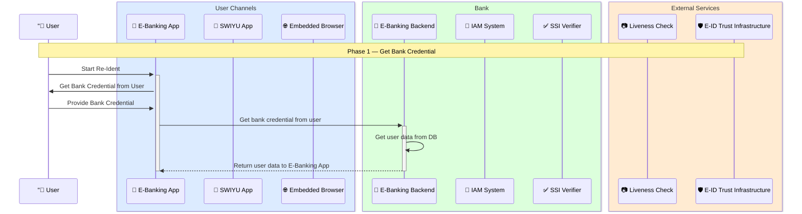
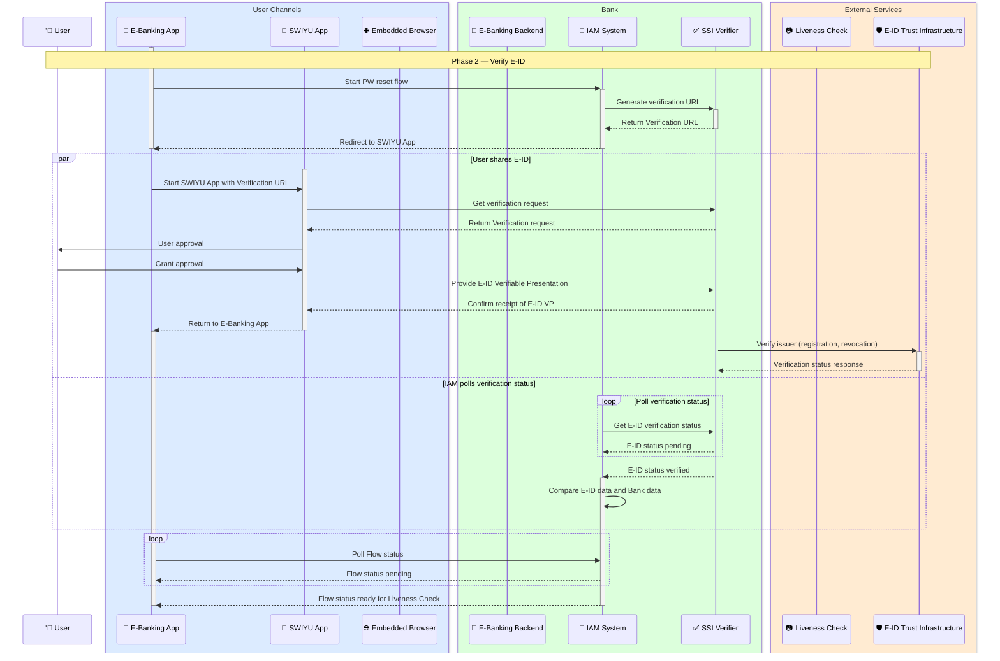
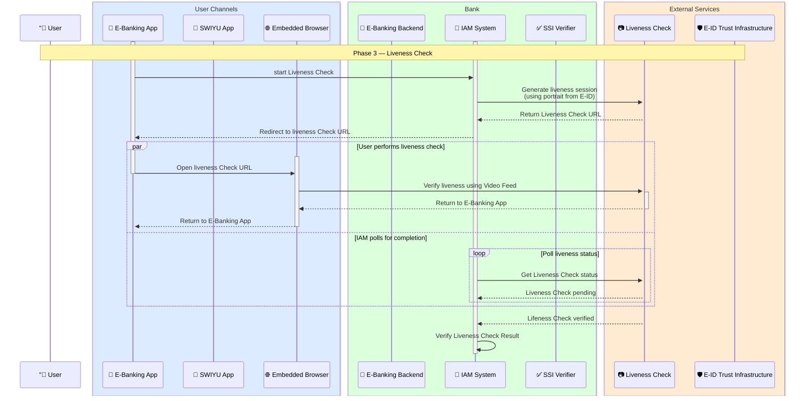

# Password Reset Flow

The passwort reset flow presented here is split into 4 phases:
1. Bank Credential: The user must supply something that identifies the user (e.g. an e-banking contract number or a loginname). This is required to fetch the user account information from the database. If the user is found, the flow proceeds to the next phase.
2. E-ID Verification: This phase asks the user to share some attributes from the E-ID (lastname, firstname, date of birth, portrait). It then compares the data from the E-ID with the data from the database. If the data matches, the flow proceeds to the next phase.
3. In this phase the portrait from the E-ID is used to run a liveness check. If the liveness check success the flow proceeds to the next phase.
4. In this pase the user can choose a new password.

## Phase 1: Get Bank Credential



## Phase 2: Verify E-ID


## Phase 3: Liveness Check


## Phase 4: Set Password
```mermaid

%%{init: {
  "theme": "default",
  "themeVariables": {
    "fontSize": "20px",
    "actorFontSize": "20px",
    "noteFontSize": "18px",
    "fontFamily": "Inter, Arial"
  }
}}%%

sequenceDiagram
    participant User as "👤 User

    box rgb(220,235,255) User Channels
        participant EBankingApp as 📱 E-Banking App
        participant SWIYUApp as 🪪 SWIYU App
        participant EmbeddedBrowser as 🌐 Embedded Browser
    end

    box rgb(220,255,220) Bank
        participant EBankingBackend as 🏦 E-Banking Backend
        participant IAMSystem as 🔐 IAM System
        participant SSIVerifier as ✅ SSI Verifier
    end

    box rgb(255,235,210) External Services
        participant LivenessCheck as 📷 Liveness Check
        participant EIDTrust as 🛡️ E-ID Trust Infrastructure
    end

    activate IAMSystem
    activate EBankingApp
    Note over User,EIDTrust: Phase 4 — Set Password

    IAMSystem-->>EBankingApp: Get Password/PIN
    EBankingApp->>User: Get Password from User
    User->>EBankingApp: Provide Password
    EBankingApp->>IAMSystem: Set Password

    IAMSystem->>IAMSystem: Update credential
    IAMSystem-->>EBankingApp: Confirm to user
    deactivate IAMSystem

    EBankingApp-->>-User: End Re-Ident

