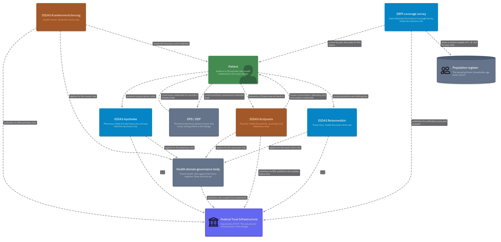
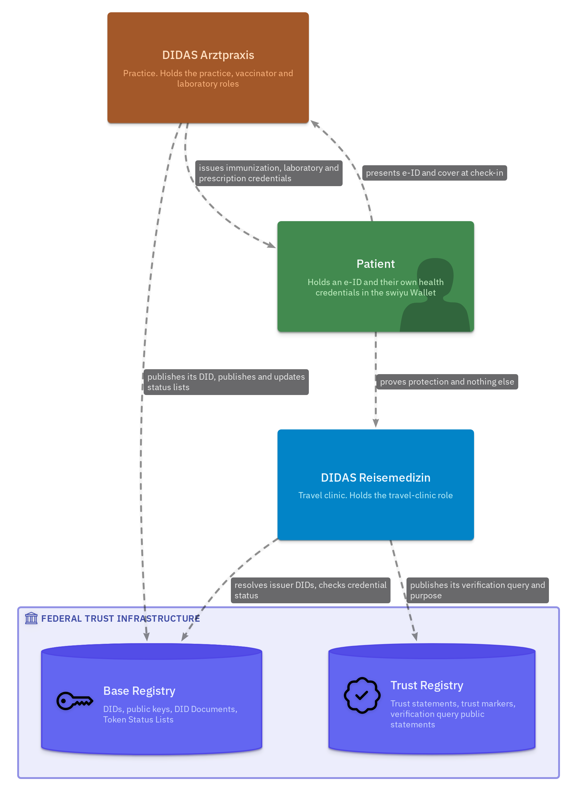
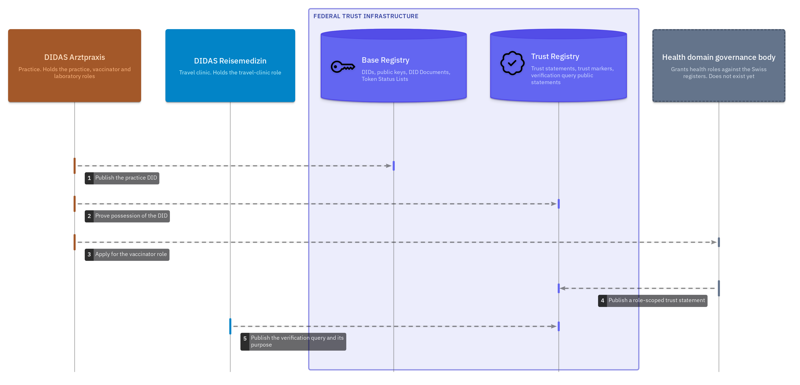
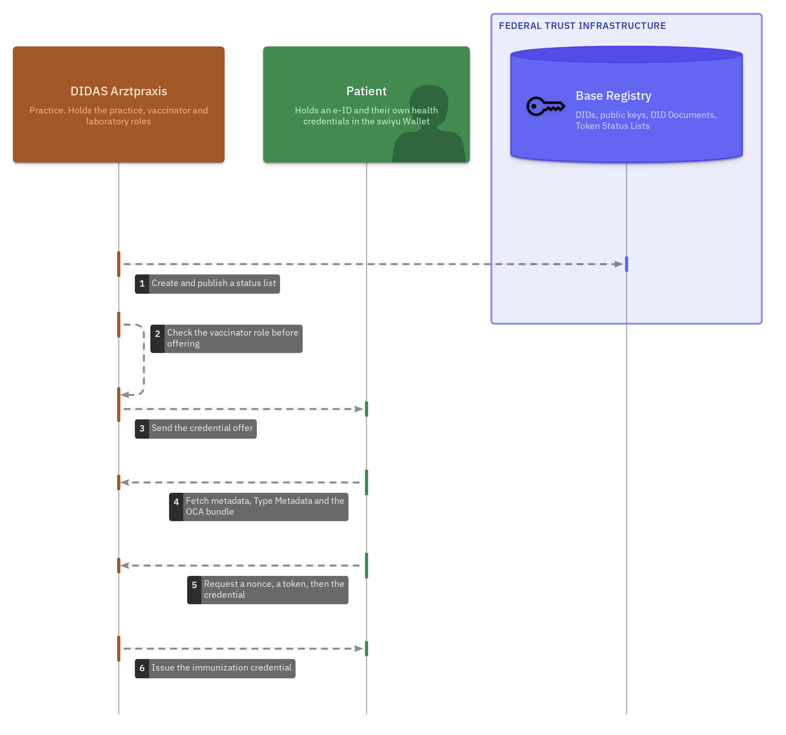
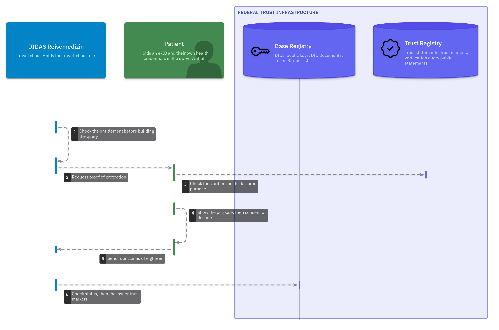
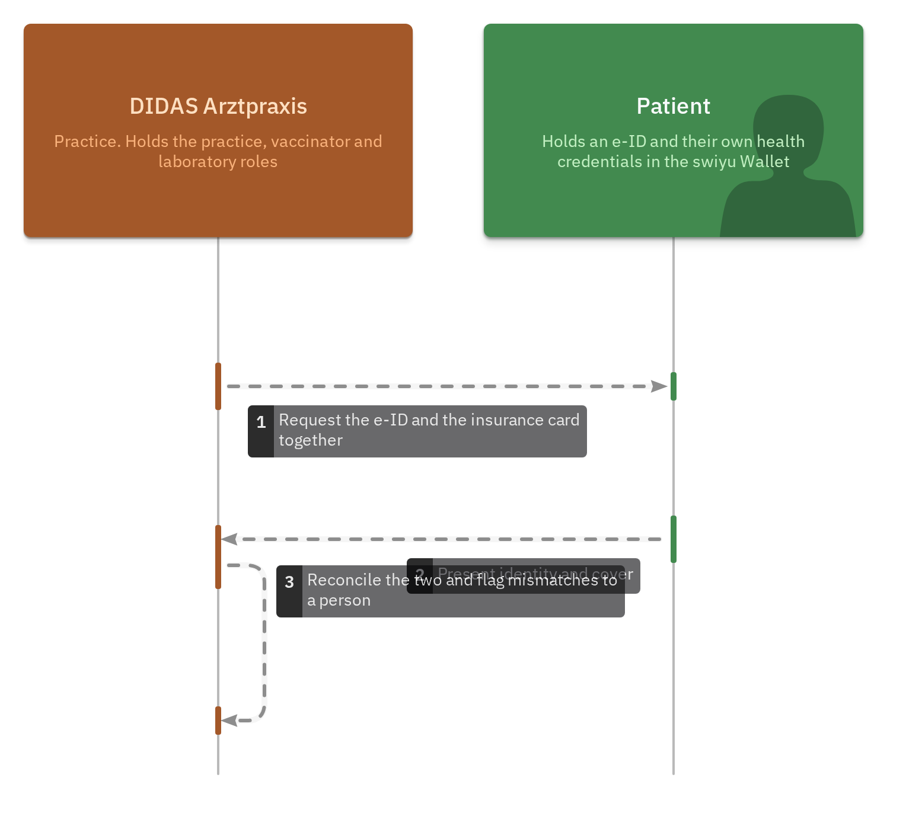
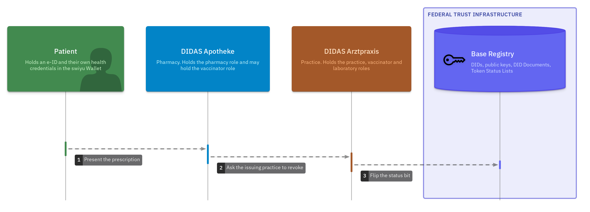
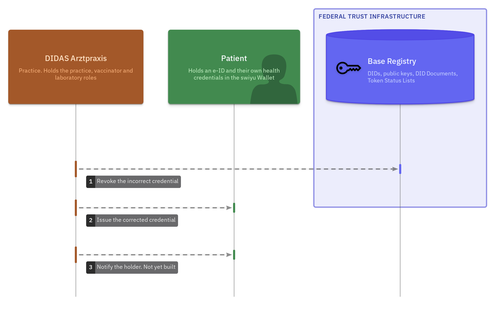
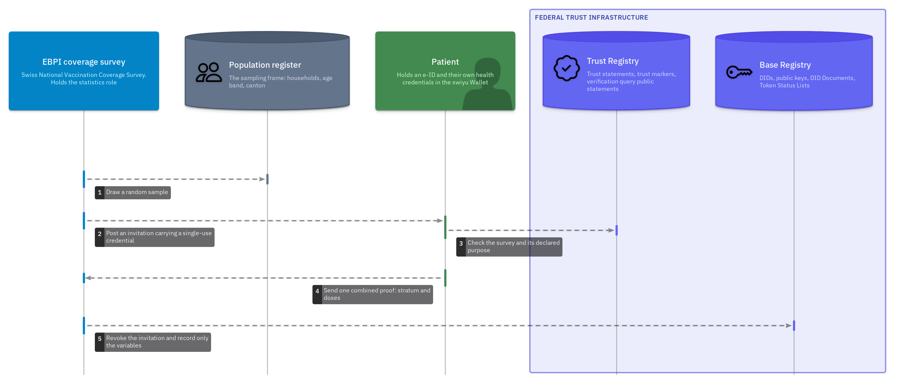

# Health

Trust flows for the health sector. A vaccination record is issued to a patient's
wallet. The consultation around it follows: check-in against an e-ID and an
insurance card, a prescription redeemed once at a pharmacy and a correction when
a dose was recorded wrongly. A final flow answers the national vaccination
coverage survey.

> **Disclaimer:** These are not official flows of the swiyu team, eHealth Suisse
> or any other authority and are published without warranty. This is a work in
> progress, for discussion purposes only. Diagrams may be updated and
> republished over time as discussions continue and the trust flows evolve.

**NOGA 2025:** division 86, Human health activities (section R). See
[`../CLASSIFICATION.md`](../CLASSIFICATION.md). Two use case families sit under
that division here. [`sector.yaml`](sector.yaml) records both.

## The showcase

A vaccination is administered. Whoever administered it issues one credential per
dose into the patient's wallet. A travel clinic later confirms the patient is
protected and receives **four claims out of the eighteen** the credential holds.
The other fourteen are never transmitted, because the wallet releases only the
claim paths the query names and the query is built from the verifier's
registered entitlement.

No registry sits in the middle. The only shared infrastructure is a status list
of two bits per credential, carrying no patient data.



The federal layer those flows depend on is small enough to draw on its own. The
Base Registry publishes DID documents and status lists. The Trust Registry
publishes trust statements about actors: who they are, what they may do and what
they say they will ask for.



## Contributors

- DIDAS Digital Health working group

---

## Family 1 · Immunization and vaccination records

### F-01 · Becoming an actor in the health trust domain

Everything else assumes an answer to one question: why should anyone believe
that the entity behind this DID is a medical practice? This flow is that answer.
It is listed first because it is the one most often skipped in prototypes.



[Open full size ↗](./diagrams/F-01-becoming-an-actor.png) ·
[Flow document](./flows/F-01-actor-onboarding.md)

Publishing the DID and proving possession of it are `basic-flow`'s
`registration` steps. What this adds is the layer above: a health governance
body granting authorisation **scoped to a role and a credential type**, checked
against the cantonal authorisation, the MedReg entry and the GLN.

That body does not exist. See [#3](https://github.com/DIDAS-swiss/Trust-Flow-Diagram-Repository/issues/3).

### F-02 · Recording an administered dose



[Open full size ↗](./diagrams/F-02-recording-a-dose.png) ·
[Flow document](./flows/F-02-immunization-issuance.md)

One credential per dose and none per person. A dose is an event with a single
author, so each issuer revokes only its own assertion and the patient's history
is assembled in the wallet.

Two steps depart from `basic-flow`'s `issuance`, both because of the Swiss
Profile. The status list exists **before** the credential that references it,
and the wallet fetches signed metadata, Type Metadata and an OCA bundle between
the offer and the token request. See
[#4](https://github.com/DIDAS-swiss/Trust-Flow-Diagram-Repository/issues/4).

### F-03 · Proving protection and nothing else



[Open full size ↗](./diagrams/F-03-proving-protection.png) ·
[Flow document](./flows/F-03-immunization-minimal-disclosure.md)

This *is* `basic-flow`'s `verification` view with a different claim name. The
reference model asks "is this person over 18?". This asks "is this person
protected against diphtheria?". Same exchange, same seven steps, including the
two that are easy to leave out, where the wallet checks the verifier's
accreditation and compares the request against its declared purpose.

The one step with no counterpart there is the holder declining, which is an
ordinary thing for a patient to do. The clinic falls back to the paper booklet
and care continues. See
[#5](https://github.com/DIDAS-swiss/Trust-Flow-Diagram-Repository/issues/5).

### F-04 · Check-in at the practice



[Open full size ↗](./diagrams/F-04-practice-check-in.png) ·
[Flow document](./flows/F-04-practice-check-in.md)

Two issuers in one presentation: the Confederation's e-ID and an insurer's card.
DCQL `multiple` is NOT SUPPORTED, so this is two queries inside one request, and
the patient consents once.

The AHV number is a **protected field**. Requesting it needs an explicit
authorization marker whatever credential carries it. The practice holds that
entitlement because it bills with the number.

### F-05 · Redeeming a prescription, exactly once



[Open full size ↗](./diagrams/F-05-prescription-redemption.png) ·
[Flow document](./flows/F-05-prescription-redemption.md)

Single use without a central register of who was prescribed what. Only the
issuer can revoke, so redemption is a request between two accountable parties.

### F-06 · Correcting a recorded dose



[Open full size ↗](./diagrams/F-06-correction.png) ·
[Flow document](./flows/F-06-lifecycle-and-correction.md)

"Recorded in error", "used up" and "we no longer recognise this" all produce the
same bit on the status list. Only the issuer's journal separates them, which is
what makes the journal a governance control.

Revocation reaches the verifier and never the holder. The superseded credential
stays in the wallet looking exactly as it did and the patient learns nothing.
That gap is what this flow is drawn to record.

### Specified, not yet modelled

| | Flow |
| --- | --- |
| [F-07](./flows/F-07-model-projection.md) | Projecting a presented credential into FHIR and openEHR |
| [F-08](./flows/F-08-patient-summary.md) | Assembling an International Patient Summary |
| [F-09](./flows/F-09-secondary-use.md) | Secondary use under revocable consent |
| [F-10](./flows/F-10-continuous-data.md) | Wearables and continuous data |

These have documents and no diagram. F-07 happens inside a relying party after a
presentation. F-08 and F-09 are compositions of F-03 across more credential
types. F-10 has an unresolved question about who authors a claim a machine
produced. Drawing them now would show a system that does not exist.

---

## Family 2 · Population health statistics

### F-11 · Answering the national coverage survey



[Open full size ↗](./diagrams/F-11-coverage-survey.png) ·
[Flow document](./flows/F-11-coverage-survey.md)

Switzerland measures vaccination coverage with the Swiss National Vaccination
Coverage Survey, run since 1999 by the Epidemiology, Biostatistics and
Prevention Institute (EBPI) at the University of Zurich with the Federal Office
of Public Health and all 26 cantons. It samples randomly selected households of
2-, 8- and 16-year-olds on a three-year rolling cycle. It asks the family to
post a copy of the child's vaccination record.

The data source is therefore already the record the family holds. This flow
replaces the photocopy. That photocopy shows every dose, every date, the
vaccinating physician and usually the child's name. A presentation sends five
claims and no name, because the survey drew the household from the population
register and already holds the age band and the canton. Of the eleven flows
here, this is the only one that sends a verifier **less** than it already
receives.

It is a separate use case family because it runs under a statistical mandate
rather than the Human Research Act. Different legal basis, different entitlement,
different retention, so a `statistics` role rather than a reuse of `research`.

**Unlinkability is the property that matters here.** The invitation posted to the
household carries a single-use credential holding the stratum (age band, canton,
cycle) and no household identifier. It is presented together with the dose claims
in one combined proof and revoked once the response is accepted, using the same
two bits on a public status list that make a prescription single-use in F-05. The
survey therefore learns that a household in a given canton with an 8-year-old
reported a given set of doses. It holds no identifier it could join that record
to.

Two leaks remain and both are technical rather than procedural. The survey
issues the invitation and revokes it, so a retained mapping from invitation index
to posted address would re-link a response by timing. The same dose credentials
presented in two cycles are linkable to each other. Closing either requires batch
issuance or a zero-knowledge presentation. Neither is in place. Until then
the flow is unlinkable by governance rule rather than by construction, which is
the weaker guarantee and is named as such in the flow document.

## The model

Everything above is generated from
[`likec4-health/health-flow.likec4`](./likec4-health/health-flow.likec4),
modelled the same way `basic-flow` is. Each step carries the protocol, the format
and the rule behind it in its notes.

```bash
npx likec4 start likec4-health                              # local server, live reload
npx likec4 export png --sequence -o diagrams likec4-health  # regenerate the images above
```

## What these flows reuse from `basic-flow`

The generic mechanics are the reference model's and are referenced instead of
repeated: publishing a DID, obtaining a token, checking a signature.
[`flows/trust-flow-basis.md`](./flows/trust-flow-basis.md) maps every step. It
says which are the reference flow under another name, which are health-specific
additions and the three the reference model has no shape for.

## Bound to the Swiss health standards

Claims carry their CH VACD or CH EMED element path, their openEHR archetype and
CKM node name and the CH Core naming system for every identifier:
`urn:oid:2.51.1.3` for GLN, `urn:oid:2.16.756.5.30.1.123.100.1.1.1` for the
insurance card number, `urn:oid:2.16.756.5.32` for the AHV number. A relying
party rebuilds whichever representation it already understands, locally, from
what the holder released.

Two points a reader of the diagrams may want:

- **CH Core reaches the same minimisation rule from the other side.**
  `CHCorePatientEPR` sets both `EPR-SPID` and `AHVN13` to `0..0`, forbidding them
  in any document shared through the EPR. These flows get there through the swiyu
  protected-field mechanism instead and land in the same place.
- **CH VACD already models supersession and merge conflicts.** F-06's correction
  uses the CH VACD `relatesTo` shape. The merge-conflict reference that
  standard defines is the answer to reconciling a vaccination series reported by
  several issuers.

[Full alignment note](https://github.com/DIDAS-swiss/digital-health_swiyu/blob/main/docs/ehealth-suisse-alignment.md),
including where this design diverges and why.

## The finding

Organisation onboarding, identity onboarding and the verification query public
statement are all self-service on the swiyu Sandbox today. The role grant is not.
**No health-domain governance body exists** to state that a given DID is a
practice authorised to vaccinate. Until one does, verification relies on
explicitly listed issuer DIDs, which is adequate for a pilot and inadequate at
scale.

The technology is ready some distance ahead of the institutional arrangements.
That is the finding these flows exist to surface. It is why F-01 is listed
first.

## Source

Built and documented in
[DIDAS-swiss/digital-health_swiyu](https://github.com/DIDAS-swiss/digital-health_swiyu),
an end-to-end implementation on the swiyu Sandbox against Swiss Profiles 1.0,
continuing [GovTech Hackathon 2024 project
1103](https://hack.opendata.ch/project/1103).
