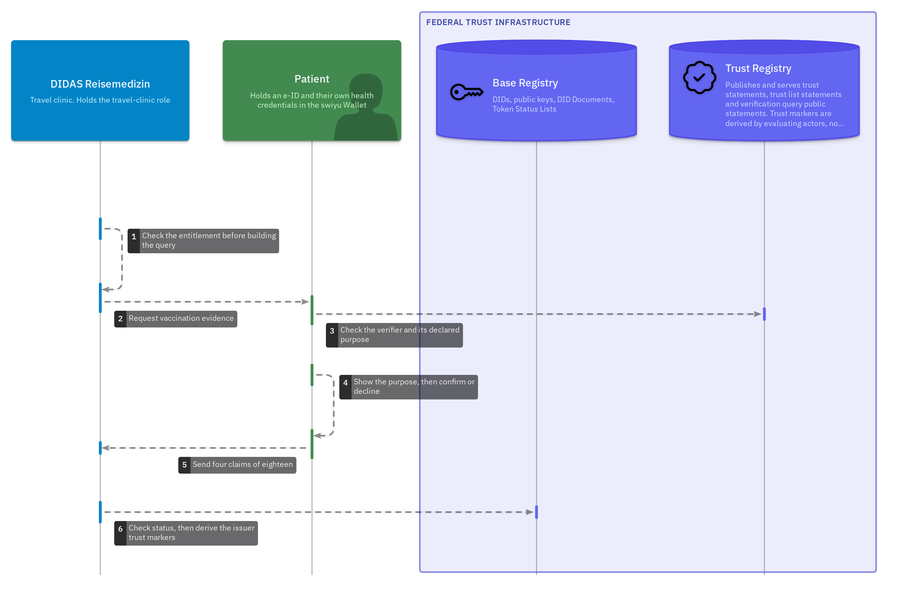

# Health

Trust flows for the health sector. A vaccination record is issued to a patient's
wallet. The consultation around it follows: check-in against an e-ID and an
insurance card, a prescription redeemed once at a pharmacy and a correction when
a dose was recorded wrongly. A final flow answers the national vaccination
coverage survey.

> **Disclaimer:** These are not official flows of the swiyu team, eHealth Suisse
> or any other authority and are published without warranty. This is a work in
> progress, for discussion purposes only. Diagrams may be updated and
> republished over time as discussions continue and the trust flows evolve.

**NOGA 2025:** division 86, Human health activities (section R), the Federal
Statistical Office's classification. Two use case families sit under that
division here. [`sector.yaml`](sector.yaml) records both.

## The showcase

A vaccination is administered. Whoever administered it issues one credential per
dose into the patient's wallet. A travel clinic later sends a presentation
request that selects **four claims of the eighteen** the credential type defines.
The wallet opens the commitments for the claim paths the query names and leaves
the others closed, so the remaining claims are not included in the presentation.
The query is built from the verifier's registered entitlement, and a query naming
a claim outside it is rejected before the request is sent.

No clinical repository sits in the middle. The shared infrastructure is a status
list carrying one entry per credential, with no clinical payload and no patient
attributes.


The federal layer those flows depend on is small enough to draw on its own. The
Base Registry publishes DID documents and status lists. The Trust Registry
publishes trust statements about actors: who they are, what they may do and what
they say they will ask for.


## Contributors

- DIDAS Digital Health working group

---

## Family 1 · Immunization and vaccination records

### F-01 · Becoming an actor in the health trust domain

Everything else assumes an answer to one question: why should anyone believe
that the entity behind this DID is a medical practice? This flow is that answer.
It is listed first because it is the one most often skipped in prototypes.


[Open full size ↗](./diagrams/F-01-becoming-an-actor.png) ·
[Flow document](./flows/F-01-actor-onboarding.md)

Publishing the DID and proving possession of it are `basic-flow`'s
`registration` steps. What this adds is the layer above: a health governance
body granting authorisation **scoped to a role and a credential type**, checked
against the cantonal authorisation, the MedReg entry and the GLN.

That body does not exist. See [#3](https://github.com/DIDAS-swiss/Trust-Flow-Diagram-Repository/issues/3).

### F-02 · Recording an administered dose


[Open full size ↗](./diagrams/F-02-recording-a-dose.png) ·
[Flow document](./flows/F-02-immunization-issuance.md)

One credential per dose and none per person. A dose is an event with a single
author, so each issuer revokes only its own assertion and the patient's history
is assembled in the wallet.

Two steps depart from `basic-flow`'s `issuance`, both because of the Swiss
Profile. The status list exists **before** the credential that references it,
and the wallet fetches signed metadata, Type Metadata and an OCA bundle between
the offer and the token request. See
[#4](https://github.com/DIDAS-swiss/Trust-Flow-Diagram-Repository/issues/4).

### F-03 · Presenting vaccination evidence with minimal disclosure



[Open full size ↗](./diagrams/F-03-minimal-disclosure.png) ·
[Flow document](./flows/F-03-immunization-minimal-disclosure.md)

This *is* `basic-flow`'s `verification` view with different claims. The
reference model requests an over-18 attestation. This requests four claims about
doses administered against a named disease. Whether the patient is protected is
an inference over the schedule, the elapsed time and clinical judgement, which
this flow does not perform and names no party accountable for. Same exchange,
same seven steps, including the two that are easy to leave out, where the wallet
checks the verifier's accreditation and compares the request against its declared
purpose.

The one step with no counterpart there is the holder declining, which is an
ordinary thing for a patient to do. The clinic falls back to the paper booklet
and care continues. See
[#5](https://github.com/DIDAS-swiss/Trust-Flow-Diagram-Repository/issues/5).

### F-04 · Check-in at the practice


[Open full size ↗](./diagrams/F-04-practice-check-in.png) ·
[Flow document](./flows/F-04-practice-check-in.md)

Two issuers in one presentation: the Confederation's Beta-ID and an insurer's
card. This demonstrator places two DCQL Credential Queries in one authorization
request. OpenID4VP 1.0 defines several Credential Queries; Swiss Profile
Verification 1.0 §6.1 states that `multiple` is NOT SUPPORTED and adds that
"only a single credential can be used in a verification", which is not explicit
about this case. Conformance of the multi-query pattern is therefore under
clarification, recorded as
[GP-01](https://github.com/Accelerate-GmbH/digital-health-swiyu-vaccination/blob/main/docs/swiss-profile-gaps.md#gp-01--multi-credential-and-multi-instance-presentation-semantics)
in the source repository. The wallet asks the holder to approve or decline the
combined request once; that approval is not, by itself, a conclusion that any
legal consent requirement has been satisfied.

The AHV number is a **protected field**. Under `swiss-profile-trust:1.0` a
verifier needs authorisation to request it whatever credential carries it. The
applicable authorisation information permits a practice to request it because it
bills with the number; during Trust Protocol evaluation that can contribute to
deriving the governed use-case authorisation marker for the interaction.

### F-05 · Redeeming a prescription, exactly once


[Open full size ↗](./diagrams/F-05-prescription-redemption.png) ·
[Flow document](./flows/F-05-prescription-redemption.md)

Single use without a central register of who was prescribed what. Only the
issuer can revoke, so redemption is a request between two accountable parties.

### F-06 · Correcting a recorded dose


[Open full size ↗](./diagrams/F-06-correction.png) ·
[Flow document](./flows/F-06-lifecycle-and-correction.md)

"Recorded in error", "used up" and "we no longer recognise this" all produce the
same bit on the status list. Only the issuer's journal separates them, which is
what makes the journal a governance control.

Revocation reaches the verifier and never the holder. The superseded credential
stays in the wallet looking exactly as it did and the patient learns nothing.
That gap is what this flow is drawn to record.

### Specified, not yet modelled

| | Flow |
| --- | --- |
| [F-07](./flows/F-07-model-projection.md) | Projecting a presented credential into FHIR and openEHR |
| [F-08](./flows/F-08-patient-summary.md) | Assembling an International Patient Summary |
| [F-09](./flows/F-09-secondary-use.md) | Secondary use under revocable research consent |
| [F-10](./flows/F-10-continuous-data.md) | Wearables and continuous data |

These have documents and no diagram, for different reasons. The source
repository classifies each flow on four independent axes, and it is the
interaction scope that decides whether a sequence view is possible.

| Flow | Why there is no diagram |
| --- | --- |
| F-07 | `kind: transformation`, `interaction_scope: local`. It happens inside one relying party after a presentation has completed, so a sequence diagram would show one lifeline |
| F-08 | `multi-party` and `composed`, so a view is possible. It is `roadmap` and not yet modelled |
| F-09 | `multi-party` and `atomic`, a presentation to a research role under its own entitlement rather than a composition of F-03. `roadmap` and not yet modelled |
| F-10 | `interaction_scope: unresolved`. What a continuing measurement exchange looks like is one of the questions the flow leaves open, so there is no exchange to draw |

F-08, F-09 and F-10 each depend on a mechanism the current Swiss Profiles do not
define, recorded as GP-01 to GP-05 and GP-10 in the
[Swiss Profile gap register](https://github.com/Accelerate-GmbH/digital-health-swiyu-vaccination/blob/main/docs/swiss-profile-gaps.md) in the source repository, which stays
authoritative for that analysis.

---

## Family 2 · Population health statistics

### F-11 · Answering the national coverage survey


[Open full size ↗](./diagrams/F-11-coverage-survey.png) ·
[Flow document](./flows/F-11-coverage-survey.md)

Switzerland measures vaccination coverage with the Swiss National Vaccination
Coverage Survey, run since 1999 by the Epidemiology, Biostatistics and
Prevention Institute (EBPI) at the University of Zurich with the Federal Office
of Public Health and all 26 cantons. It samples randomly selected households of
2-, 8- and 16-year-olds on a three-year rolling cycle. It asks the family to
post a copy of the child's vaccination record.

The data source is therefore already the record the family holds. This flow
replaces the photocopy. That photocopy shows every dose, every date, the
vaccinating physician and usually the child's name. The presentation request
modelled here selects five coded claims and no name. The stratum the analysis
needs, the age band and the canton, arrives inside the invitation credential the
survey issued, so the request does not name a person identifier. Of the eleven
flows here, this is the one whose presentation discloses **less** than the
procedure it would replace.

It is a separate use case family because it runs under a statistical mandate
rather than the Human Research Act. Different legal basis, different entitlement,
different retention, so a `statistics` role rather than a reuse of `research`.

**Which correlation surfaces the design closes, and which it leaves open.** The
invitation posted to the household carries a single-use credential holding the
stratum (age band, canton, cycle) and no household identifier. It is presented
together with the dose claims in one combined response and revoked once the
response is accepted, using the same status-list mechanism that makes a
prescription single-use in F-05. What the survey receives is therefore a set of
dose claims attributed to a canton and an age band, with no person identifier
among the disclosed claims.

Two correlation surfaces stay open, and both are technical rather than
procedural. The survey issues the invitation and revokes it, so an invitation
index retained alongside the posted address would allow a response to be
associated with that address by timing. The same dose credentials presented in
two cycles expose stable credential-level information, so the two presentations
may be correlatable to each other. Closing the first requires batch issuance;
closing the second requires a presentation format that does not expose a stable
credential identifier. Neither is in place here. Until then the property rests on
the operator's retention rules rather than on the protocol, which the flow
document states rather than claiming the property outright.

## The model

Everything above is generated from
[`likec4-health/health-flow.likec4`](./likec4-health/health-flow.likec4),
modelled the same way `basic-flow` is. Each step carries the protocol, the format
and the rule behind it in its notes.

```bash
npx likec4 start likec4-health                              # local server, live reload
npx likec4 export png --sequence -o diagrams likec4-health  # regenerate the images above
```

## What these flows reuse from `basic-flow`

The generic mechanics are the reference model's and are referenced instead of
repeated: publishing a DID, obtaining a token, checking a signature.
[`flows/trust-flow-basis.md`](./flows/trust-flow-basis.md) maps every step. It
says which are the reference flow under another name, which are health-specific
additions and the three the reference model has no shape for.

## Bound to the Swiss health standards

Claims carry their CH VACD or CH EMED element path, their openEHR archetype and
CKM node name and the CH Core naming system for every identifier:
`urn:oid:2.51.1.3` for GLN, `urn:oid:2.16.756.5.30.1.123.100.1.1.1` for the
insurance card number, `urn:oid:2.16.756.5.32` for the AHV number. A relying
party rebuilds whichever representation it already understands, locally, from
what the holder released.

Two points a reader of the diagrams may want:

- **CH Core reaches the same minimisation rule from the other side.**
  `CHCorePatientEPR` sets both `EPR-SPID` and `AHVN13` to `0..0`, forbidding them
  in any document shared through the EPR. These flows get there through the swiyu
  protected-field mechanism instead and land in the same place.
- **CH VACD already models supersession and merge conflicts.** F-06's correction
  uses the CH VACD `relatesTo` shape. The merge-conflict reference that
  standard defines is the answer to reconciling a vaccination series reported by
  several issuers.

[Full alignment note](https://github.com/Accelerate-GmbH/digital-health-swiyu-vaccination/blob/main/docs/ehealth-suisse-alignment.md),
including where this design diverges and why.

## The finding

Organisation onboarding, identity onboarding and the verification query public
statement are all self-service on the swiyu Sandbox today. The role grant is not.
**No health-domain governance body exists** to state that a given DID is a
practice authorised to vaccinate. Until one does, verification relies on
explicitly listed issuer DIDs, which is adequate for a pilot and inadequate at
scale.

The technology is ready some distance ahead of the institutional arrangements.
That is the finding these flows exist to surface. It is why F-01 is listed
first.

## Source

Canonical source:
[Accelerate-GmbH/digital-health-swiyu-vaccination](https://github.com/Accelerate-GmbH/digital-health-swiyu-vaccination).
The contribution is published in the DIDAS ecosystem at
[DIDAS-swiss/digital-health_swiyu](https://github.com/DIDAS-swiss/digital-health_swiyu).
It is a prototype on the swiyu Sandbox against Swiss Profiles 1.0, continuing
[GovTech Hackathon 2024 project 1103](https://hack.opendata.ch/project/1103).
