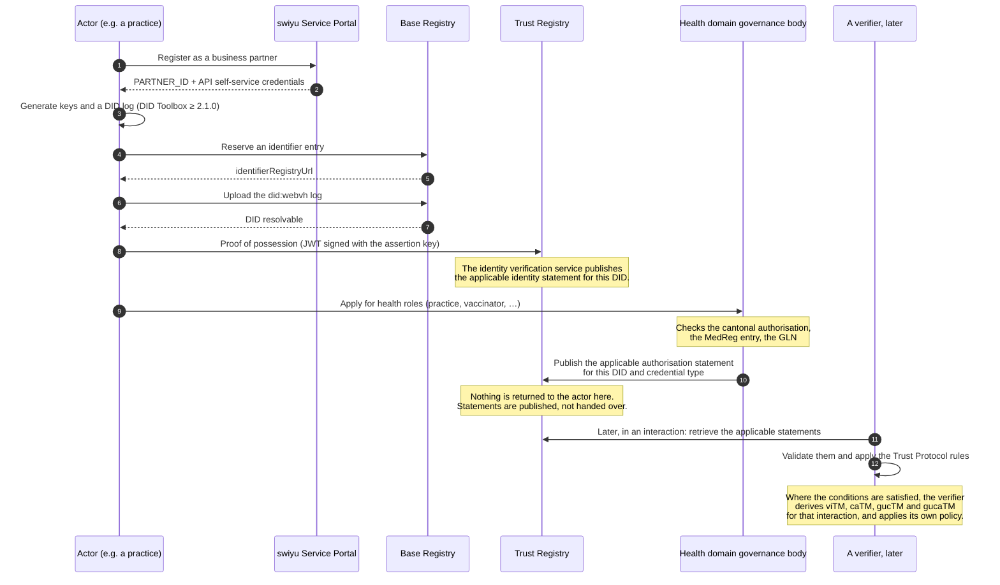

# F-01 · Becoming an actor in the health trust domain

Everything else in this blueprint assumes the answer to one question: *why
should anyone believe that the entity behind this DID is a medical practice?*
This flow is that answer. It is listed first because it is the flow most often
omitted in prototypes, and because every later flow depends on its outcome.

The key publication, the accreditation request and the trust statement that
comes back are the `registration` view of the reference model. This flow
takes them as given. See the [reference
diagram](https://didas-swiss.github.io/Trust-Flow-Diagram-Repository/basic-flow/)
for what happens inside each. What it adds is the layer above: a health
governance body granting role-scoped authorisation, which the reference model
has no shape for
([#3](https://github.com/DIDAS-swiss/Trust-Flow-Diagram-Repository/issues/3)).
The full mapping is in [`trust-flow-basis.md`](trust-flow-basis.md).

## Sequence

**Statements are published. Markers are derived.** The Trust Registry publishes
and serves statements; it does not hand a marker to an actor, and an actor does
not hold one. A trust marker is the result an evaluating actor derives from the
applicable valid statements and the Trust Protocol rules, for one trust
relationship or interaction. The last three steps above are drawn here because
leaving them out is what makes a marker look like a possession.

## Three layers, often collapsed into one

"Onboarding" names three different things here and conflating them is why this
flow is usually misjudged as blocked when two thirds of it are available today:

| Layer | What it establishes | Available? |
| --- | --- | --- |
| Organisation | An ePortal account, a business partner, API access | **Yes**, self-service, chargeable per DID |
| Identity | A `did:webvh` on the Base Registry, proven by possession. An identity statement is published, from which an evaluating actor can derive `viTM` | **Yes**, self-service |
| Transparency | A Verification Query Public Statement (vqPS): this verifier, this scope, this DCQL query, published | **Yes**, self-service, per verifier per query |
| Entitlement | An authorisation statement saying this DID may issue *this credential type* in health, from which an evaluating actor can derive `gucaTM` for an interaction | **No**, no health-domain governing authority exists to publish it |

Only the last layer is blocked. A pilot runs on the first three plus explicitly
listed `accepted_issuer_dids`, which is what this project does.

## Governance constraints

- **Someone has to make the governance decision.** The health domain needs a
  governing actor that decides which organisations hold which roles and
  publishes the applicable authorisation statement. This project models the
  roles (`ROLE` in `@didas/swiyu`) and the entitlements attached to them and
  assumes such an actor exists. **It does not exist yet.** That is the largest
  gap between this blueprint and a deployable system, and it is an institutional
  question rather than an implementation one.
- **DIDAS health roles are project-local.** `ch.didas.health.role.*` is this
  project's governance vocabulary. It is not Trust Protocol role vocabulary, and
  the role identifier is not a Trust Protocol claim or marker. A deployment can
  map the governance decision a role represents onto one or more applicable
  Trust Protocol authorisation statements; the role itself does not travel in
  the protocol.
- **Authorisation decisions must be checkable against existing registers.**
  Inventing a register for this ecosystem: the cantonal authorisation to
  practise, the MedReg entry, the GLN in the Refdata index, the BAG number for
  insurers. A published statement that is not traceable to one of these is a new
  register in disguise.
- **The authorisation to issue and the authorisation to verify are separate.** A
  pharmacy that may verify a prescription does not thereby become able to issue
  one. Trust Protocol 2.0 keeps these in different statement types, a Protected
  Issuance Authorization Trust Statement (`piaTS`) and a Protected Verification
  Authorization Trust Statement (`pvaTS`), and this project's entitlement model
  keeps them apart as `issuerRole` versus `verifierRoles`.
- **Protected fields need their own authorisation.** Under
  `swiss-profile-trust:1.0`, `personal_administrative_number`, the AHV number,
  requires authorisation regardless of which credential carries it. The
  applicable authorisation information permits a practice to request it; during
  Trust Protocol evaluation that can contribute to deriving the governed
  use-case authorisation marker for the interaction. A practice needs it to
  bill; a pharmacy does not; both are health actors. The authorisation is per
  claim.
- **Withdrawal must propagate.** When an authorisation to practise is withdrawn,
  the published statement has to be withdrawn too. Otherwise a later evaluation
  still finds a valid statement, still derives the marker, and credentials
  issued afterwards still pass the signature and status checks a verifier
  performs. Nothing in the technical stack notices this on its own.

## Standardisation constraints

- **`did:webvh` only.** Change dossier CD-001 requires new DIDs to use
  `did:webvh`; the earlier `did:tdw` spelling is the same method renamed, and
  DIDs created under the old tooling had to be re-onboarded. Use DID Toolbox
  ≥ 2.1.0 and DID Resolver ≥ 2.8.0.
- **The Base Registry constrains the DID document.** `service`, `alsoKnownAs`,
  `keyAgreement`, `capabilityInvocation` and `capabilityDelegation` are not
  supported; `publicKeyJwk` is required and `publicKeyMultibase` must not be
  used; `portable` must be `false`, `witness` `{}` and `watchers` `[]`. A DID
  document that is valid per the W3C spec can still be rejected here.
- **One signature algorithm.** ES256, everywhere, in all four profiles.
- **Environment separation is enforced.** CD-001 separates the Sandbox from
  production: the swiyu Wallet talks only to production, the swiyu Sandbox
  Wallet only to the Sandbox and a Sandbox DID may no longer be hosted on a
  private registry. An actor needs a distinct onboarding per environment.

## Open questions

1. **Who governs the health domain?** A cantonal health authority, the FOPH, a
   sector association, or a body constituted for the purpose. Until this is
   answered, no authorisation statement exists for a health credential type, so
   no evaluation can derive `gucaTM` for one, and every deployment falls back to
   explicitly listed issuer DIDs, which does not scale past a pilot. Note what this does *not* block: a verifier can already publish
   a vqPS declaring exactly what it asks for and why, so the transparency half
   of the Trust Protocol is available now. What is missing is the half that says
   an actor is *entitled* to ask.
2. **How is a health authorisation expressed in an applicable statement?** This
   project names roles as reverse DNS strings (`ch.didas.health.role.practice`),
   which is project-local vocabulary rather than anything the Trust Protocol
   defines. Whether the ecosystem adopts a shared vocabulary, or each domain
   invents its own, determines whether a verifier from another sector can
   interpret a health authorisation at all. This project does not add a health
   role field to a Trust Protocol statement type, because the protocol defines
   no such field.
3. **What is the appeal path** when a role is refused or withdrawn? A trust
   registry entry has real economic consequences for a practice.

## Implementation status

`partial`. The role model, the entitlements and the derivation of trust markers
from seeded statements are implemented and tested. The onboarding itself is manual and documented in
`docs/onboarding-sandbox.md`; in the bundled mock, trust statements are seeded
directly, with the insurer deliberately lacking `caTM` so that the strict policy
visibly refuses it.
