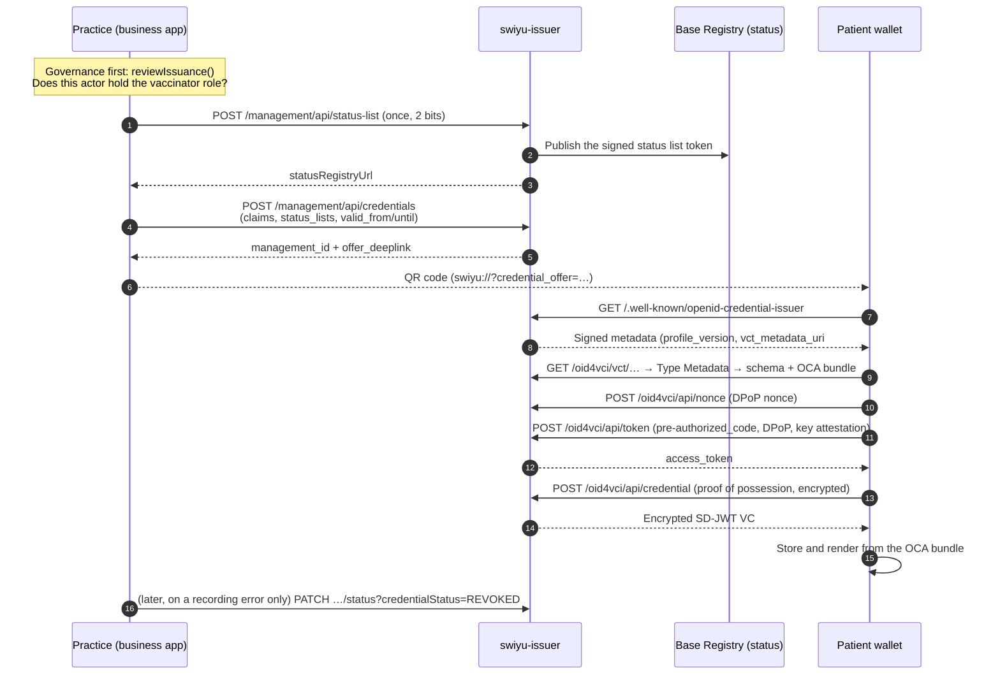

# F-02 · Recording an administered dose

The showcase flow. A vaccination is administered, the vaccinator issues a
credential attesting the dose it administered, and the wallet stores that
credential under its own storage and lifecycle model.

The offer, the token exchange and the credential request are the `issuance` view
of the reference model. Two things here depart from it, both because of the
Swiss Profile: the status list exists before the credential that references it,
and the wallet fetches signed metadata, Type Metadata and an OCA bundle between
the offer and the token request
([#4](https://github.com/DIDAS-swiss/Trust-Flow-Diagram-Repository/issues/4)).
See [`trust-flow-basis.md`](trust-flow-basis.md).

## Why this shape

`meineimpfungen.ch` held the national electronic vaccination record until its
closure in 2021, after which the records it held were no longer accessible to
the people they described. The episode illustrates the availability and
continuity risks of relying on a single service for access to longitudinal
health information: such a service can be withdrawn, defunded or discontinued,
and access is then lost for everyone it served at the same time. That is an
architectural consideration rather than a judgement on any particular
implementation.

Three design decisions follow, each weighed against an obvious
choice:

- **One credential per dose.** A dose is an event with a single author, the
  party that administered it. Issuing one credential per dose keeps
  authorship intact, lets each issuer revoke only their own assertion and means
  the patient's history is assembled in the wallet, under the patient's control.
  The cost is that "is this series complete?" becomes a question about several
  credentials instead of a lookup, which F-03 and F-08 have to handle.
- **The holder retains a copy independently of the issuer's systems.** Once
  issued, the credential is held in the patient's wallet and does not depend on
  the issuing organisation's operational system to remain in the holder's
  possession. Continued *verification* is a separate matter: it may still depend
  on identifier resolution, status list availability, trust statements, the
  issuer's signing key remaining resolvable, and the wallet itself. F-05 records
  the case this cuts against — a prescription whose issuer can no longer revoke
  it.
- **No expiry on the event.** A vaccination that happened stays happened, so
  `exp` is set far out and the credential is not
  refreshable: there is nothing for a refresh to fetch.

## Sequence

Steps 8 to 14 are entirely the generic issuer's work. The business application does
steps 1 to 5 and, rarely, the last one. That division is the reason for using the
generic components: DPoP, key attestation, mandatory response encryption and
signed metadata are where conformance is decided and implementing them inside a
practice management system would place that burden on every vendor.

## Governance constraints

- **Only an authorised vaccinator may issue.** `reviewIssuance()` refuses before
  any request reaches the issuer and the refusal is journalled. In a deployed
  ecosystem the underlying authorisation would be published as an applicable
  authorisation statement naming this credential type, from which a verifier's
  Trust Protocol evaluation could derive `gucaTM` for the interaction. The legal basis is modelled here
  on EpG/LEp plus the cantonal authorisation to vaccinate; that reading is this
  project's own and legal review is required before deployment
  ([source verification](https://github.com/Accelerate-GmbH/digital-health-swiyu-vaccination/blob/main/docs/source-verification.md)).
- **Revocation corrects, it does not retract.** The only legitimate reason to
  revoke a dose credential is that it records something that did not happen:
  wrong patient, wrong vaccine, duplicate entry. Revoking to express "we no
  longer recognise this vaccination" would make the status list a policy
  instrument and a patient's record would become contestable by any party that issued
  it. This is a governance rule with no technical enforcement: the status list
  cannot tell the two motives apart, so it has to be written down and audited.
- **The patient is not asked to approve issuance in the wallet**, because the
  vaccination itself was agreed in the consultation. The wallet confirmation
  step attaches to *disclosure* (F-03), which is where the holder chooses what
  leaves the wallet.
- **The vaccinator keeps their own record.** The credential is not the practice's
  documentation; professional documentation duties are unaffected by it. What
  changes is that the patient's copy is no longer a printout.

## Standardisation constraints

- **SD-JWT VC only.** ISO mdoc and W3C VCDM are not supported by the profile.
- **Pre-authorized code flow only.** The authorization code flow and
  wallet-initiated issuance are not supported; `authorization_details` and
  `scope` are not supported. The issuer links the credential to the wallet
  through the pre-authorized code alone.
- **Every business claim is selectively disclosable.** `swiss-profile-vc:1.0.0`
  §3.2.2.4 requires it of all of them, so the holder decides what to release at
  presentation. F-03 shows a minimal-disclosure presentation of this credential.
- **Encryption is mandatory in both directions**, and
  `encryption_required` must be `true` in the metadata.
- **Batch size ≥ 10** where batch issuance is used. It is a privacy floor and a
  tuning parameter: a small batch forces frequent refreshes and hands the issuer
  telemetry about when the credential is used.
- **Model reuse without a repository.** Claims carry FHIR element paths (CH VACD
  today, `Immunization-uv-ips` from roadmap step 2) and openEHR archetype paths
  (`openEHR-EHR-ACTION.medication.v1`). Vaccine products are SNOMED CT coded;
  target diseases separately so that F-03 can ask about the disease without the
  brand.
- **The `vct` is a URN.** `urn:vct:ch.didas.health.immunization:1.0`
  does not change when a deployment moves host, so issued credentials and DCQL
  queries keep their meaning; resolution goes through `vct_metadata_uri`, which
  the profile gives precedence anyway.

## Open questions

1. **Series semantics across issuers.** Dose 2 is administered by a pharmacy
   that cannot see dose 1. Today `dose_number` and `doses_in_series` are asserted
   by the administering party, which means a wallet holding two "dose 1 of 3"
   credentials is possible. Resolving this needs either a presentation at
   administration time (the wallet shows what it holds) or a series identifier.
   Both are F-08 territory.
2. **Vaccine coding.** SNOMED CT product codes here; CH VACD also permits ATC
   and national codes and IPS has its own expectations. Picking one is a
   governance decision with interoperability consequences.
3. **Paediatric and representative-held credentials.** A child's vaccinations
   belong in whose wallet? The trust infrastructure has no representation model
   yet. This blocks the largest real population for immunization records.

## Implementation status

`implemented`. `PraxisService.issueImmunization` in `apps/demo`; credential type
in `packages/swiyu/src/credentials/immunization.ts`; covered by
`apps/demo/test/journey.test.ts`.
