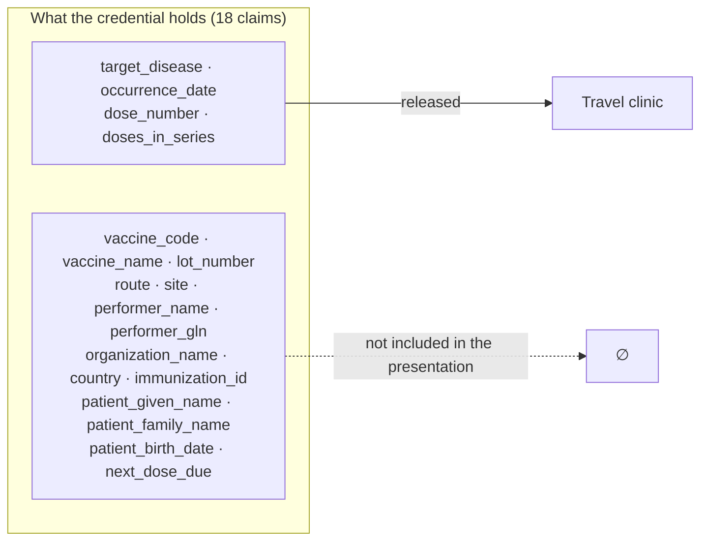
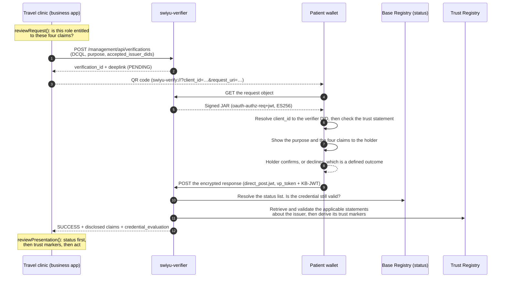

# F-03 · Presenting vaccination evidence with minimal disclosure

A travel clinic needs evidence about the doses a patient has received against a
particular disease. It does not need the vaccine brand, the batch number, the
administering practitioner or the organisation, and it already holds the
patient's name from the appointment.

**What this flow produces is evidence, not a clinical conclusion.** The
credential attests that a dose was administered, on a date, as dose *n* of a
series. Whether the person is protected is an inference over the vaccination
schedule, the elapsed time and clinical judgement. This flow implements no such
inference and identifies no party accountable for one; the clinician makes it.
The distinction matters because "protected" and "has received these doses" are
not the same statement, and only the second is signed.

Mechanically this is the `verification` view of the reference model with
different claim names, so the mechanics are left to the [reference
diagram](https://didas-swiss.github.io/Trust-Flow-Diagram-Repository/basic-flow/)
and what follows is about what a travel clinic may request. One step here has no
counterpart there: the holder declining
([#5](https://github.com/DIDAS-swiss/Trust-Flow-Diagram-Repository/issues/5)).

## What is actually different here

A paper vaccination booklet handed across a counter is read as a whole page, and
a PDF exported from a portal contains the whole file. What a query against
another system discloses depends on that system's access controls and audit
model and is not a property this flow can assert. What this flow implements is
narrower and checkable: the wallet releases the claim paths the DCQL query
names, and the query is built from the requesting role's entitlement.

The credential carries eighteen claims. The travel clinic's entitlement permits
four. The remaining fourteen are not redacted after the fact and not filtered by
the verifier after receipt. They are not included in the presentation, because
the wallet opens the commitments for the claim paths the DCQL query names and
the query is constructed from the requesting role's entitlement.

## Sequence

## Governance constraints

- **The entitlement is the ceiling. It is enforced before the request is
  built.** `reviewRequest()` refuses a query for claims outside the role's
  entitlement, so an over-broad request is not sent to the patient. A check
  applied at the wallet or after receipt would operate on claims the verifier
  already holds, so it would constrain later use rather than which claims were
  disclosed.
- **The purpose is registered.** `verification_purpose` carries a
  stable scope plus localised name and description, shown to the holder before
  the confirmation step and registered at the transparency service. A verifier that wants
  to ask a different question has to say so under a different scope.
- **Declining is a first-class outcome.** `client_rejected` is a normal answer,
  not an error and the flow must work when the patient says no, which for a
  travel clinic means falling back to the paper booklet and care continues.
- **The verifier keeps the conclusion.** The retention rule
  on this credential type is explicit: a travel clinic needs to record that the
  series was confirmed. The governance journal
  records claim *names*, never values.
- **Two distinct trust decisions.** Before the presentation, the wallet
  evaluates the trust information published about the verifier and shows the
  request to the holder for confirmation. During verification, the verifier
  evaluates the credential issuer and the applicable trust information. These
  are separate decisions made by separate parties. A verifier without `viTM`
  requesting health data is the case the wallet-side decision exists to catch,
  and the wallet is the last point at which it can be made before any claim is
  transmitted.

## Standardisation constraints

- **`response_mode` must be `direct_post.jwt`.** The presentation response is
  always encrypted; cleartext `direct_post` is not an option under the profile.
- **The authorization request must be a signed JAR.** `client_id` is the
  verifier's DID, optionally prefixed `decentralized_identifier:` and must match
  the `kid` of the signature without its fragment.
- **DCQL `multiple` is NOT SUPPORTED**, and §6.1 adds that "only a single
  credential can be used in a verification". Whether that also rules out several
  Credential Queries in one verification is not stated. This flow uses one query.
  F-04 uses two as an implementation pattern under clarification, and F-08 needs
  an unknown number of instances of one type, which the profile does not provide
  for. See
  [GP-01](https://github.com/DIDAS-swiss/digital-health_swiyu/blob/main/docs/swiss-profile-gaps.md#gp-01--multi-credential-and-multi-instance-presentation-semantics).
- **Trusted authorities are DID-based.** The DCQL trusted-authority types in the
  base OID4VP specification do not apply; the Swiss Profile defines a `did` type
  carrying a list of accepted issuer DIDs.
- **The Key Binding JWT's `aud` must be the verifier's `client_id`** and the
  wallet must first satisfy itself that the `client_id` belongs to the entity
  that signed the JAR. This is the anti-impersonation check: without it, the
  other controls can be satisfied by a party impersonating the verifier.
- **Status is checked at the Base Registry.** The profile
  forces the status provider to be the registry precisely so that presenting a
  credential does not tell its issuer where it was used.

## Open questions

1. **"Protected against X" is an inference.** The credential says
   which diseases a dose targets and when it was given. Whether that amounts to
   protection depends on the schedule, the number of doses and elapsed time. Who
   is accountable for that inference is unresolved: the verifier's software, a
   published rule set, or the clinician. It is a clinical-safety question
   for the sector to settle.
2. **Correlation across presentations.** Repeated presentations of the same
   credential may be correlatable where they expose stable credential-level or
   claim-level information, so two verifiers that exchange presentation data may
   be able to determine that both presentations relate to the same credential.
   The surfaces here are the credential identifier, the holder key, the
   status-list reference, the disclosed claim values and the presentation
   timing. Batch issuance reduces the credential-level surface and is not used
   here, because across a series of dose credentials the disclosed claim values
   are themselves close to identifying. This flow does not remove those
   surfaces, and stating so is part of the record.
3. **Enumerating the susceptible.** Coverage *measurement* is less affected
   than it looks: the Swiss National Vaccination Coverage Survey samples
   households and reads the record the family holds, so it never queried a
   register. What a decentralised record removes is the ability to find the
   individuals who are behind: outbreak response and catch-up campaigns. F-09
   sketches secondary use under research consent, which is research rather
   than surveillance, because a self-selected sample is biased in ways a
   prevalence estimate cannot correct for. See `docs/public-health.md`.

## Implementation status

`implemented`. `TravelClinicService` in `apps/demo`; the four-of-eighteen
disclosure is asserted in `apps/demo/test/journey.test.ts`, including that the
withheld claims are absent from the response.
