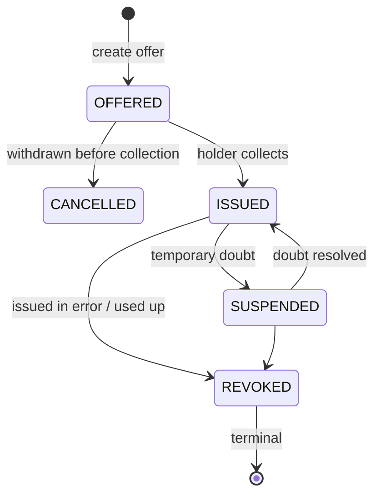

# F-06 · Correction, suspension and revocation

Every credential in this project carries a status list reference. This flow is
what that reference is for and where the difference between three superficially
similar operations matters.

| Operation | Status value | Reversible | Means |
| --- | --- | --- | --- |
| Suspend | `0x02` SUSPENDED | yes, via `ISSUED` | "Do not rely on this for now": cover under clarification, a result under review |
| Revoke | `0x01` INVALID | **no** | "This assertion should not have been made" |
| Cancel | `0x01` INVALID | no | The offer was withdrawn before the holder collected it |
| Business expiry | `expiry_date` claim | n/a | The wallet warns; the verifier decides |
| Technical expiry | `exp` | n/a | The credential cannot be presented at all |

The distinction that matters most is the last pair. `expiry_date` is a business
fact the verifier may choose to accept. An expired e-ID is still adequate proof
of being over 18. `exp` is absolute. Collapsing the two, which is the natural
instinct, removes the verifier's judgement from cases where it belongs.

## Governance constraints

- **Revocation is terminal and must be treated as such.** The mock refuses to
  move a credential out of `REVOKED`, because a demo that let you undo it would
  teach the wrong lesson.
- **The motive is not in the mechanism.** "Recorded in error", "used up" and "we
  no longer recognise this" produce the same bit. Only the issuer's journal
  distinguishes them, which makes the journal a governance control and the
  convenience.
- **Revocation reaches the verifier.** The credential stays in
  the wallet and stops working. Whether the holder is told and by whom, is
  unspecified by the standards and needs a policy: silently dead credentials are
  a poor experience and, for a vaccination record, potentially a clinical risk.
- **Publication to the registry is public.** The Swiss Profile states it directly:
  information on a status list is public information. A suspension is therefore a
  disclosure, which is a reason to prefer revocation-on-correction over
  suspension-on-suspicion for sensitive credential types.

## Standardisation constraints

- Two bits per entry, the only configuration supporting both revocation and
  suspension. Type, configuration and length are immutable once the list is
  initialised.
- Size limits: the status list token must exceed 200 bytes and must not exceed
  200 KB decompressed, giving roughly 100'000 entries at two bits.
- `iat` must be within the last 24 hours and `exp` must be in the future for the
  registry to accept an upload, so a status list must be re-signed and
  republished regularly even when nothing changes.
- The status provider must be the registry provided by FOITT rather than the
  issuer (`swiss-profile-vc:1.0.0` §12.1). A verifier resolving status against
  the registry therefore does not contact the issuer at presentation time, which
  reduces what the issuer can observe about where and when its credentials are
  used. It does not make presentations unobservable in general: the registry
  sees the request, and other channels may still correlate.
- **The status list does not encode a reason.** Each entry carries a status
  value and no accompanying reason, so "recorded in error", "used up" and "no
  longer recognised" are indistinguishable to a verifier reading the entry. The reason is
  recorded on the issuer side, in the governance journal and the lifecycle
  policy, which is why the governance rules above have to be written down and
  audited rather than inferred from the list.

## Open questions

1. **Holder notification.** Nothing in the stack tells a patient that a
   credential they hold has been revoked.
2. **Status list capacity planning.** An issuer that exhausts a list must
   initialise another; which list a credential landed on is then part of its
   identity. Rotation strategy is unspecified here.
3. **Correction as re-issuance.** A corrected lab result should probably be a new
   credential referencing the revoked one. There is no `supersedes` claim in this
   project's types and adding one is a modelling decision with IPS implications
   (F-08).

## Implementation status

`partial`. Revocation and suspension work end to end through the issuer
management API and are covered by tests. Holder notification, status list
rotation and supersession are not implemented.
