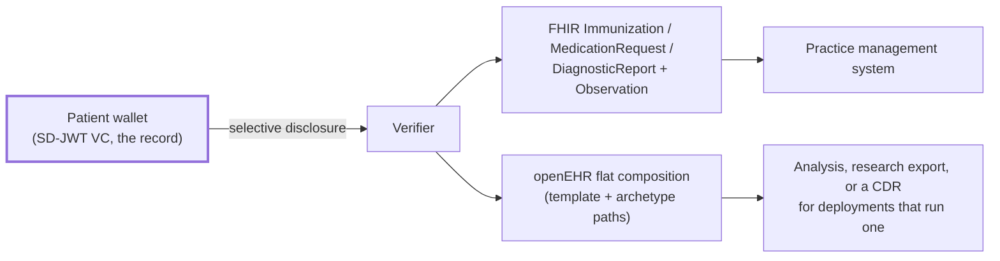

# F-07 · Projecting a presented credential into FHIR and openEHR

This flow is the answer to the obvious objection: *the health sector already has
information models and systems that speak them. Why would it adopt a credential
format?*

It does not have to. The credential carries the model with it.

## The architectural position

HL7 FHIR and openEHR provide established models and implementation patterns for
representing, exchanging and, in openEHR's case, persisting clinical
information: archetypes, templates, resource profiles and terminology bindings,
representing decades of clinical modelling work and the reason a laboratory
result means the same thing in two systems. Verifiable credentials and the swiyu
Trust Infrastructure address a different layer: authenticity, provenance,
controlled presentation and trust relationships. These layers can be composed.

This demonstrator reuses the information models and does not operate a FHIR
server or an openEHR clinical data repository. That is a scope choice for this
prototype, not a judgement on either architecture; a deployment composing the
two is described in [positioning](https://github.com/DIDAS-swiss/digital-health_swiyu/blob/main/docs/positioning.md).

Every claim in every credential type carries the FHIR element path and, where
one exists, the openEHR archetype path it corresponds to. At presentation, the
receiving system can rebuild the representation it already understands, locally,
from the claims the holder released.

## Two properties to preserve

- **A projection is derived, not authoritative.** The signed SD-JWT VC is the
  verifiable artefact. The FHIR resource built from it carries no signature, so
  nothing about its provenance can be checked from the resource alone. A system
  that needs to evidence provenance later has to retain the presentation
  alongside the projection. A system that retains only the projection cannot
  reconstruct it.
- **A projection is legitimately partial.** After selective disclosure, a
  `DiagnosticReport` may have findings and no patient name. Receiving systems
  must tolerate that instead of treating a missing element as an error. This is
  the main integration cost of the whole approach.

## Governance constraints

- **Projection does not launder entitlement.** Claims the verifier was not
  entitled to are absent from the projection because they were never disclosed.
  Nothing downstream can reconstruct them.
- **Retention attaches to the projection too.** Building a FHIR resource is how a
  verifier retains data; the retention rule on the credential type governs it.
- **Unmapped claims are reported.** Both projections return the list
  of disclosed claims that had no binding, so a modelling gap surfaces instead of
  silently losing data.

## Standardisation constraints

- Immunization → `Immunization` (CH VACD; `Immunization-uv-ips` from step 2) and
  `openEHR-EHR-ACTION.medication.v1`.
- Prescription → `MedicationRequest` (CH EMED) and
  `openEHR-EHR-INSTRUCTION.medication_order.v3`.
- Laboratory report → `DiagnosticReport` + one `Observation` per finding, and
  `openEHR-EHR-OBSERVATION.laboratory_test_result.v1`.
- Insurance card → `Coverage` (CH Core). No openEHR model: openEHR describes the
  clinical record.
- Terminology: SNOMED CT for vaccines and diseases, LOINC for analytes, UCUM for
  units, GTIN for medication packs, GLN for professionals, AHVN13 for the
  protected administrative number.
- openEHR output is flat format: template path to value, with `:n` indices on
  repeating nodes. That is what a CDR's flat endpoint accepts for deployments
  that have one.

## Open questions

1. **Round-tripping.** Projection is one-way. Whether a FHIR resource should be
   convertible back into a credential is a step-2 question, as is who would sign
   the result. Both are raised by the openEHR/HL7 joint working group's
   ambitions.
2. **`meta.profile` names a profile; conformance to it is not asserted.** A
   projected resource carries `meta.profile` as a pointer to the profile it is
   shaped towards, and this repository does not claim the resource conforms to
   that profile. No resource has been run through a FHIR validator: the FHIR
   package registry is unreachable from the environment this is developed in,
   so `hl7.fhir.r4.core` and the CH IG packages cannot be obtained.
   `packages/swiyu/test/ch-profile-conformance.test.ts` pins the constraints
   checkable without a validator and records one known non-conformance, the
   mandatory `CHVACDExtensionVerificationStatus` that the projection does not
   emit. See [eHealth Suisse alignment](https://github.com/DIDAS-swiss/digital-health_swiyu/blob/main/docs/ehealth-suisse-alignment.md).
3. **openEHR templates are sketched and unpublished.** `DIDAS.immunisation.v0`
   and its siblings are named here; real operational templates would have to be
   modelled and published for the paths to be more than plausible.

## Implementation status

`implemented`. `packages/swiyu/src/projections.ts`, covered by
`packages/swiyu/test/projections.test.ts` and visible in the demo UI next to
the credential it was built from.
