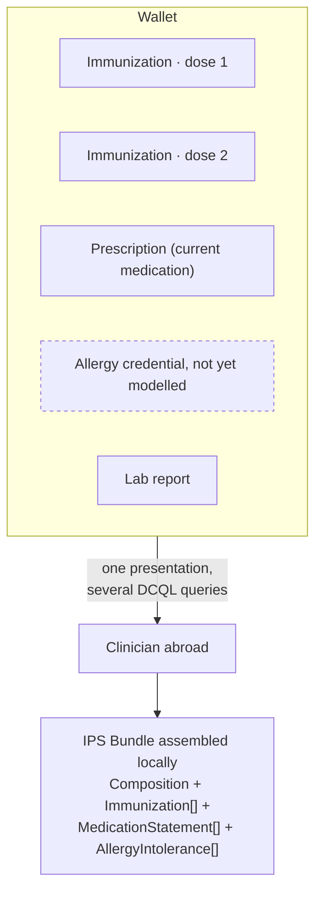

# F-08 · Assembling an International Patient Summary (roadmap, 2027)

Roadmap step 2. Specified here, deliberately not built.

> **Beyond the current Swiss Profile.** This flow requires several independently
> issued credentials to contribute to one clinical summary, including several
> instances of the same credential type where the count is not known when the
> request is built. `swiss-profile-verification:1.0.0` §6.1 states that DCQL
> `multiple` is NOT SUPPORTED, and adds that "only a single credential can be
> used in a verification". The profile is not explicit about whether several
> Credential Queries may appear in one verification, so this repository treats
> that case as requiring clarification rather than as settled. Either way, an
> International Patient Summary needs a mechanism for an unknown number of
> matching instances of one credential type, which the current profile does not
> define. Recorded as
> [GP-01](https://github.com/DIDAS-swiss/digital-health_swiyu/blob/main/docs/swiss-profile-gaps.md#gp-01--multi-credential-and-multi-instance-presentation-semantics),
> and not a capability this repository assumes today. Cross-border presentation
> raises [GP-10](https://github.com/DIDAS-swiss/digital-health_swiyu/blob/main/docs/swiss-profile-gaps.md#gp-10--cross-domain-and-cross-border-trust-evaluation).

The International Patient Summary is the standardised minimum dataset for
unplanned care: allergies, current medication, problems and immunizations. That
last section is why it belongs in this blueprint. It is designed for the case where a
clinician who has never seen you needs to know the few things that could kill
you, possibly in another country.

The design question is **where the summary is assembled**. The usual answer is a
national infrastructure that holds the data and renders a summary on request.
The proposal here is that the wallet assembles it: an IPS Bundle
constructed at presentation time from the credentials the patient holds, each
contributed by its own issuer, each independently verifiable.

## What step 2 has to solve

- **Credential types this project does not model.** Allergies and intolerances,
  active problems and medication *statements* as distinct from prescriptions.
  These carry most of the clinical weight in an IPS. Each needs the same
  treatment F-02 gave immunizations: a model, an issuer role, an entitlement.
- **Multi-credential presentation.** An IPS spans several credentials. DCQL
  `multiple` is NOT SUPPORTED, and the profile is not explicit about several
  Credential Queries in one verification. Even if that case is confirmed, a
  patient holding twelve dose credentials needs a mechanism for an unknown number
  of matching instances, which the profile does not define. GP-01 sets out the
  three cases the profile would have to separate.
- **Completeness is unknowable.** A summary assembled from held credentials can
  only report what the patient holds. A clinician reading it must be able to tell
  "no known allergies" from "no allergy credential present". The IPS has
  `absent/unknown` codes for exactly this and using them correctly is the
  difference between a useful summary and a dangerous one.
- **Series reconciliation** (open question 1 of F-02) has to be resolved before
  an immunization section can be trusted.
- **EPD/EGD integration.** Future work should examine how the Swiss electronic
  patient record infrastructure and holder-controlled verifiable credentials can
  interoperate, including the potential issuer, source, verifier and repository
  roles each could play. This project does not prescribe a target architecture.

## Governance constraints to carry forward

- Emergency access is the hardest case in the whole architecture: the patient may
  be unconscious and consent-at-presentation assumes they are not. Any
  break-glass mechanism introduces a party able to read the record without the
  holder's involvement, which is in direct tension with consent-at-presentation.
- Cross-border presentation means a verifier outside the Swiss trust registry.
  Either the trust infrastructure federates, or the flow degrades to "a
  clinician reads a rendered summary and decides how much to believe it".
- An IPS is a clinical document; who is accountable for a summary nobody
  authored is a genuine question that does not arise when a clinician compiles it.

## Why it is not built here

Step 1 is a working end-to-end case with governance. Step 2 requires modelling
three further credential types, resolving multi-credential presentation, and
answering the emergency-access question. Building a partial IPS would suggest
those are solved.
