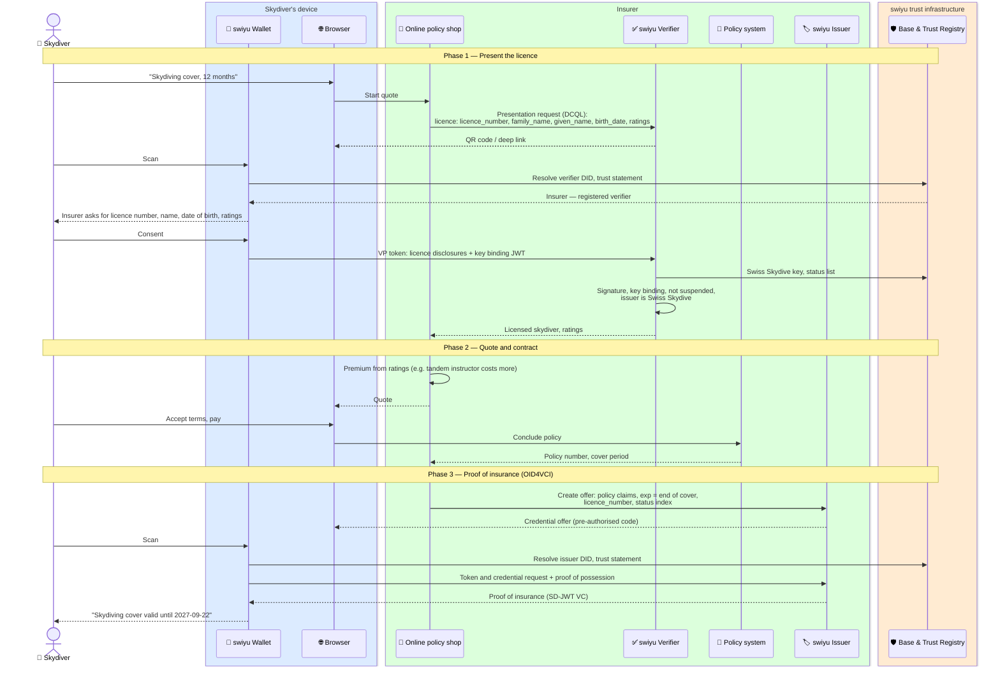

# Insurance

Trust flows in which an insurer is the relying party: it verifies a credential
before taking on a risk, and issues proof of cover afterwards.

> Not an official flow of the swiyu team, any insurer or any other authority —
> published without warranty. Work in progress, for discussion purposes only.

## Contributors

- Daniel (DIDAS)

---

## Skydiving insurance with the licence

A skydiver takes out liability and accident cover by presenting the skydiving
licence from [`sport/`](../sport), and receives a proof of insurance as a
second credential. At the drop zone both are presented together with the
reserve repack ([manifest check-in](../sport/manifest-check-in.md)).

Status: **draft**.

**Requires** `qualification-credential-held` · **Establishes** `insurance-cover-held`

The insurer can be an insurance company selling directly, or Swiss Skydive
acting for a group policy that comes with membership. The flow is the same;
only the DID on the proof of insurance differs, and with it what the drop zone
has to trust. See [assumptions](#assumptions).

### The proof of insurance

| Claim | Example | Notes |
| --- | --- | --- |
| `vct` | `https://example-insurer.ch/vc/sport-cover/v1` | Placeholder. A shared type across insurers would let drop zones accept any of them |
| `policy_number` | `SK-2026-000184` | |
| `cover` | `["third-party-liability", "accident"]` | What is covered. Drop zones usually ask for liability |
| `liability_limit` | `CHF 2,000,000` | Optional, for drop zones with a minimum |
| `activity` | `skydiving` | |
| `territory` | `worldwide` | Matters at foreign drop zones |
| `valid_from`, `exp` | `2026-09-23`, `2027-09-22` | The drop zone rejects expired cover without asking the insurer |
| `licence_number` | `CH-12345` | Links the cover to the licence it was granted on. Checked at manifest |
| `family_name`, `given_name`, `birth_date` | | Copied from the licence |
| `status` | status list reference | For cancellation during the term or non-payment |
| `cnf` | holder key | Same wallet as the licence |

The link between the two credentials is `licence_number`, not the holder key.
Wallets may use a fresh key per credential, so the drop zone cannot rely on
both credentials carrying the same `cnf`.

### Assumptions

- **Who issues.** If the cover comes with Swiss Skydive membership, Swiss
  Skydive may issue the proof itself and the drop zone trusts one issuer. If an
  insurer sells it, each accepted insurer must be on the Trust Registry and the
  drop zone needs a list of the ones it accepts.
- **Which rating costs what** is the insurer's business. The flow only shows
  that the ratings are disclosed so it can decide.
- **Cancellation.** A policy cancelled during its term is revoked through the
  status list. Expiry needs no revocation.
