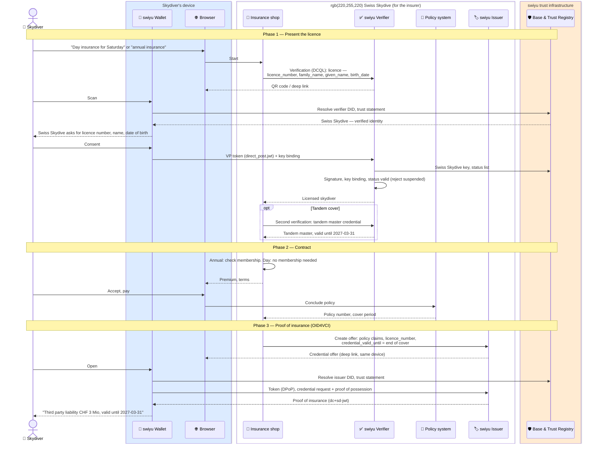

# Insurance

Trust flows in which an insurer is the relying party: it verifies a credential
before taking on a risk, and issues proof of cover afterwards.

> Not an official flow of the swiyu team, any insurer or any other authority —
> published without warranty. Work in progress, for discussion purposes only.

## Contributors

- Daniel (DIDAS)

---

## Skydiving insurance with the licence

A skydiver buys liability cover by presenting the skydiving licence from
[`sport/`](../sport), and receives a proof of insurance as a credential. At
the drop zone it is checked together with the licence and the reserve repack
([manifest check-in](../sport/manifest-check-in.md)).

Status: **draft**.

**Requires** `qualification-credential-held` · **Establishes** `insurance-cover-held`

### Today

| | | Source |
| --- | --- | --- |
| Legal minimum | The VLK (SR 748.941) requires third-party liability insurance for damage on the ground of at least CHF 1 million, and the insurance certificate must be carried on the jump | VLK, read from a search excerpt; article not verified |
| Where skydivers buy it | Swiss Skydive sells **day insurance** and **annual insurance** online; cover starts when payment is complete. Annual insurance requires active Swiss Skydive membership, which in turn requires Aero-Club membership | Swiss Skydive FAQ |
| Insurer and product | **AXA** parachute insurance. The annual product shows as "Skydiving third party liability insurance **CHF 3 Mio**" | Swiss Skydive *Find a Member* lookup |
| Term | The annual insurance expires on **31 March**, the same day as the licence, whenever in the season it was bought | Swiss Skydive *Find a Member* lookup |
| Without a licence | Also sold to people without a Swiss Skydive licence; the lookup shows their AXA insurance under licence number `0` | Swiss Skydive *Find a Member* lookup |
| Where it shows | In the member area and in the public *Find a Member* lookup, next to the licence | Swiss Skydive |
| At the drop zone | Licence, reserve data card, logbook and insurance under Swiss law are checked. Some drop zones ask foreign jumpers for at least CHF 3 million | Drop zone websites |

So the issuer is **Swiss Skydive**, selling and administering an AXA policy.
The flow shows it that way. An insurer selling directly would run the same
flow with its own DID, and each drop zone would have to accept that DID as
well.

Presenting the licence is the normal path, and the one this flow shows: it
fills in the person and links the policy to the licence. It is not a
precondition, since Swiss Skydive also insures people without a licence.
They present the e-ID instead and the proof carries no `licence_number`; the
drop zone then checks their foreign licence separately.

### Flow

The licence is presented once, when buying. The insurer does not need it
again for the proof to stay valid: the proof names the `licence_number`, and
the drop zone matches the two.

### The proof of insurance

| Claim | Example | Notes |
| --- | --- | --- |
| `vct` | `https://swissskydive.org/vc/skydiving-insurance/v1` | Placeholder. One shared type across insurers would let drop zones accept any of them |
| `policy_number` | `SK-2026-000184` | |
| `product` | `Skydiving third party liability insurance CHF 3 Mio` | The description as shown today |
| `product_type` | `annual` or `day` | |
| `cover` | `["third-party-liability"]` | What is covered; other covers only if Swiss Skydive sells them |
| `liability_sum` | `3000000` | In CHF. Drop zones compare it with their minimum; the law asks for at least CHF 1 million |
| `territory` | `worldwide` | Matters at foreign drop zones |
| `valid_from` | `2026-09-18` | The date on today's row |
| `expiry_date` | `2027-03-31` | Expire. Annual insurance ends on 31 March; day insurance on the day |
| `exp` (protected) | `2027-03-31` | Same day, set via `credential_valid_until`. After it the wallet will not present the proof |
| `licence_number` | `1234` | Links the cover to the licence it was bought with. Absent for insured people without a licence |
| `family_name`, `given_name`, `birth_date` | | From the licence |
| `insurer` | `AXA` | Human-readable; trust rests on the issuer DID |
| `status` (protected) | 1-bit list | Cancellation during the term |
| `cnf` (protected) | holder key | |

The link between licence and insurance is `licence_number`, not the holder
key: wallets use a fresh key per credential, so the drop zone cannot rely on
the two carrying the same `cnf`.

Day insurance fits swiyu's whole-day validity exactly: `exp` is the jump
day, and the proof cannot be presented the day after.

### Assumptions and open questions

1. May Swiss Skydive issue the proof for the AXA policy in its own name, or
   does AXA want to be the issuer?
2. Does a proof in the wallet satisfy the VLK's duty to carry the insurance
   certificate on the jump? That is a question for FOCA.
3. What cover and minimum sum apply to commercial tandem jumps?
4. Cancellation during the term is revoked through the status list. Expiry
   needs no revocation.
