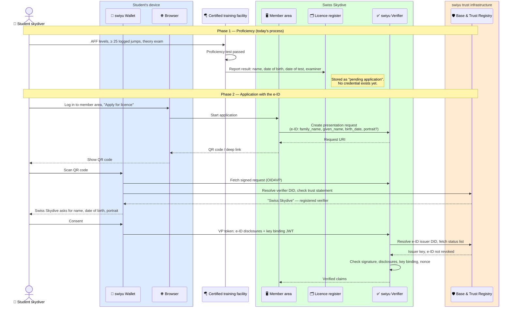
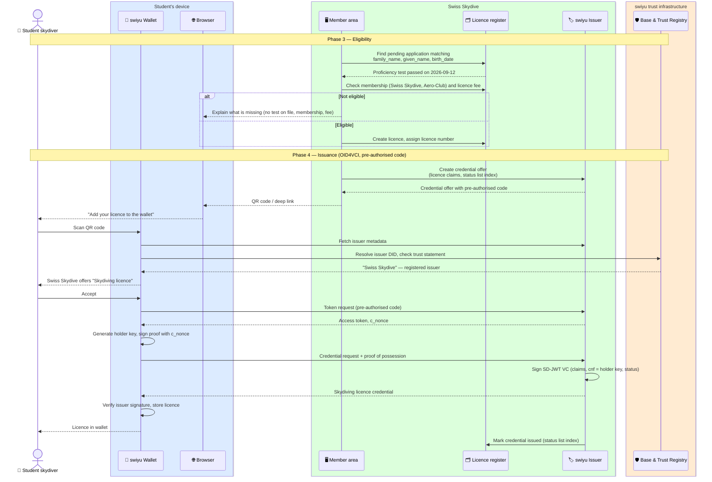

# Licence issuance

Swiss Skydive issues the skydiving licence as a verifiable credential into the
skydiver's swiyu wallet. The e-ID replaces the copy of an identity document in
the application, and the licence carries the name and date of birth taken from
it, so a verifier later needs one credential rather than two.

Status: **draft**. See the [open questions](./README.md#open-questions-for-swiss-skydive).

**Requires** `eid-held` · **Establishes** `qualification-credential-held`

The flow runs in four phases:

1. **Proficiency.** The student finishes AFF training and passes the proficiency
   test at a certified facility, which reports the result to Swiss Skydive. This
   is today's process and is only shown so the trigger is clear.
2. **Application with the e-ID.** The student applies in the Swiss Skydive
   member area and presents name, date of birth and, optionally, portrait from
   the e-ID over OID4VP.
3. **Eligibility.** Swiss Skydive matches the e-ID to the reported test,
   checks membership and fee, and creates the licence in its register.
4. **Issuance.** The member area shows a credential offer, and the wallet
   collects the licence over OID4VCI.

Before any of this, Swiss Skydive has registered as issuer and verifier on the
swiyu trust infrastructure: a DID in the Base Registry and a trust statement in
the Trust Registry. That one-time setup is the `registration` view of
[`basic-flow/`](../basic-flow).

## Phase 1 and 2: proficiency and application

The portrait is optional. Requesting it only makes sense if Swiss Skydive puts
it into the licence, which is a decision about the credential schema
(see the [README](./README.md#the-licence-credential)).

## Phase 3 and 4: eligibility and issuance

## Where trust is decided

| Decision | Made by | On the basis of |
| --- | --- | --- |
| This really is Swiss Skydive asking for my e-ID | Wallet | Verifier DID and trust statement in the Trust Registry |
| This person is the one who passed the test | Swiss Skydive | Match of e-ID claims against the facility's report |
| The student may hold a licence | Swiss Skydive | Test result, membership, fee — its own rules, outside swiyu |
| This really is Swiss Skydive issuing | Wallet | Issuer DID and trust statement in the Trust Registry |
| The licence can only be used from this wallet | Issuer, later every verifier | `cnf` holder key and key binding JWT |

## Assumptions

- Matching the e-ID to the facility's report on name and date of birth is
  enough. If two students share both, the licence register needs a further
  key, such as the Swiss Skydive member number, entered by the student.
- The facility keeps reporting through Swiss Skydive's existing channel. A
  later version could have the facility issue a "proficiency test passed"
  credential that the student presents together with the e-ID, which removes
  the matching step entirely.
- Licence fee and membership are handled in the member area as today.
