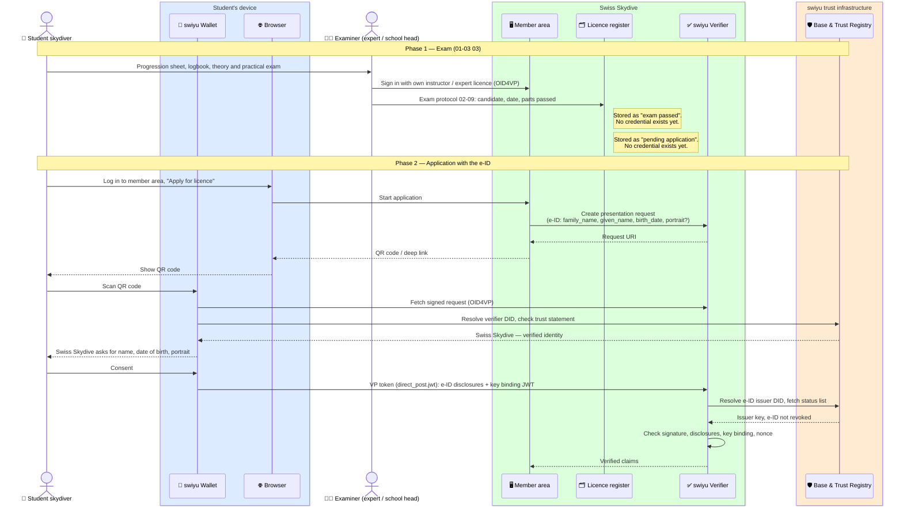
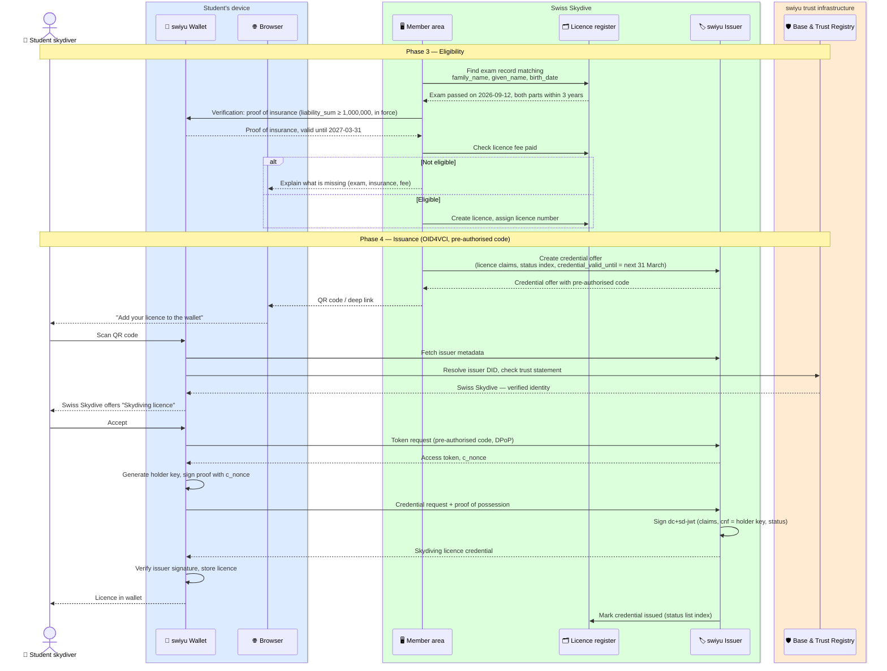

# Licence issuance

Swiss Skydive issues the skydiving licence as a verifiable credential into the
skydiver's swiyu wallet. The e-ID replaces the copy of an identity document in
the application, and the licence carries the name and date of birth taken from
it, so a verifier later needs one credential rather than two.

Status: **draft**. See the [open questions](./README.md#open-questions-for-swiss-skydive).

**Requires** `eid-held`, `insurance-cover-held` · **Establishes** `qualification-credential-held`

## The rules: directive 01-03 *Skydiver*

Read from 01-03f *Parachutiste* (valid from March 2022; the German version
prevails):

| Topic | Rule | § |
| --- | --- | --- |
| Progression sheet | Issued by a Swiss Skydive school, from age 15; minors need written consent of their legal representative | 01.01–03 |
| Training | Static line or AFF levels 1–3, then training jumps with tests: safety (4 turns in 12 s), tracking, figures, packing and equipment check | 02 |
| Exam | Theory (5 subjects, 12 min each, ≥ 75 % per subject) and practical (2 accuracy landings within 50 m, 1 docking jump, independence). Both within **3 years** of passing the first part | 03 |
| Examiner | An expert, a school head, or the school head's named deputy — an active instructor with a valid Swiss Skydive instructor licence, and not the one who trained the candidate entirely alone | 03.25–27 |
| Application | After both parts, the candidate applies to Swiss Skydive with the **exam protocol, form 02-09**, signed by the examiner | 03.05 |
| Validity | **Only once third-party liability insurance** for damage on the ground (VLK art. 13) is in force | 01.06 |
| Term | From the date of issue to **31 March** of the following year | 04.06 |
| Refusal, withdrawal | On well-founded doubts about mental or moral fitness | 04.04 |
| Foreign licence | < 200 jumps: full training and exam. 200–500: practical exam plus the law/directives/safety theory. > 500: that theory only | 04.05 |

The flow runs in four phases:

1. **Exam.** The examiner signs the exam protocol (02-09). Today it is paper;
   here the examiner signs in with their own instructor or expert licence and
   records the result, so the register knows it came from someone allowed to
   examine.
2. **Application with the e-ID.** The candidate applies in the Swiss Skydive
   member area and presents name, date of birth and, optionally, portrait from
   the e-ID over OID4VP.
3. **Eligibility.** Swiss Skydive matches the e-ID to the exam record and
   checks the fee, and — because the licence is not valid without it — the
   liability insurance, by asking for the proof of insurance credential.
4. **Issuance.** The member area shows a credential offer, and the wallet
   collects the licence over OID4VCI.

Before any of this, Swiss Skydive has onboarded as issuer and verifier on the
swiyu trust infrastructure: a `did:webvh` DID each in the Base Registry and a
Trust Protocol 2.0 identity trust statement in the Trust Registry (see
[implementing on swiyu](./swiyu-implementation.md#recommended-implementation-for-swiss-skydive)). That one-time setup is the `registration` view of
[`basic-flow/`](../basic-flow).

## Phase 1 and 2: exam and application

The portrait is optional. Requesting it only makes sense if Swiss Skydive puts
it into the licence, which is a decision about the credential schema
(see the [README](./README.md#the-licence-credential)).

## Phase 3 and 4: eligibility and issuance

## Where trust is decided

| Decision | Made by | On the basis of |
| --- | --- | --- |
| This really is Swiss Skydive asking for my e-ID | Wallet | Verifier DID and trust statement in the Trust Registry |
| This person is the one who passed the test | Swiss Skydive | Match of e-ID claims against the facility's report |
| The student may hold a licence | Swiss Skydive | Test result, membership, fee — its own rules, outside swiyu |
| This really is Swiss Skydive issuing | Wallet | Issuer DID and trust statement in the Trust Registry |
| The licence can only be used from this wallet | Issuer, later every verifier | `cnf` holder key and key binding JWT |

## Assumptions

- Matching the e-ID to the exam record on name and date of birth is
  enough. If two students share both, the licence register needs a further
  key, such as the Swiss Skydive member number, entered by the student.
- The examiner records the exam in the member area instead of posting form
  02-09. A later version could issue the candidate an "exam passed"
  credential, which removes the matching step entirely.
- The progression sheet (01-03 01.03) could itself be a credential issued by
  the school — it is what admits a student to the jump operation (01-00d
  05.10). Not drawn here.
- Licence fee is handled in the member area as today.
