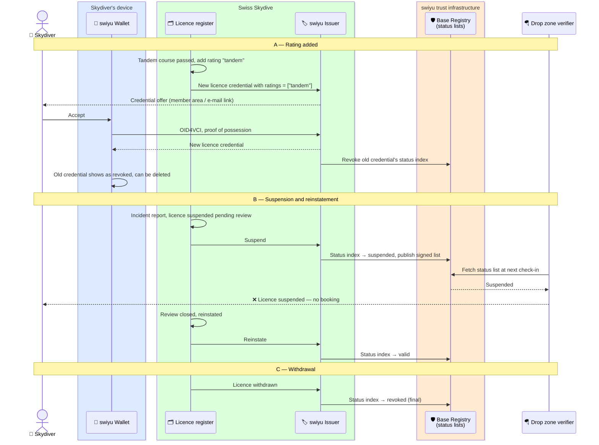

# Licence lifecycle

What happens to the licence credential after it is issued: a rating is added,
a name changes, the licence is suspended after an incident or withdrawn.

Status: **draft**.

An SD-JWT VC cannot be edited. Every change is therefore one of two moves:

| Change | Move |
| --- | --- |
| Rating added (e.g. tandem, wingsuit), name changed | Issue a new credential, revoke the old one |
| Suspension after an incident, pending review | Set the old credential's status to *suspended*; clear it if the review ends well |
| Licence withdrawn | Set the status to *revoked* |
| Member asks for the credential to be removed, device lost | Revoke; re-issue to the new wallet on request |

The licence register at Swiss Skydive stays the source of truth. The status
list is how its decisions reach every verifier without the verifier ever
calling Swiss Skydive, and without Swiss Skydive learning who checked.

## Knock-on effects on the other credentials

- **Proof of insurance** carries the `licence_number`, not a copy of the
  licence status. A drop zone that checks both sees a suspended licence and
  stops there. Whether the insurer also cancels the policy is its own rule.
- **Reserve repack** is about a rig and is not affected by the owner's licence.
  If the *rigger's* rigger licence is withdrawn, Swiss Skydive stops accepting new
  repacks from them. Existing repack credentials stay valid unless a repack is
  found faulty, in which case they are revoked individually.
- A new licence credential after a **name change** keeps the licence number,
  so the proof of insurance still matches.

## Assumptions

- The swiyu Token Status List supports a *suspended* state alongside *revoked*.
  If only revocation is available, a suspension becomes revoke-and-reissue.
- Swiss Skydive decides about suspension and withdrawal under its own rules.
  The flow shows how the decision propagates, not how it is taken.
