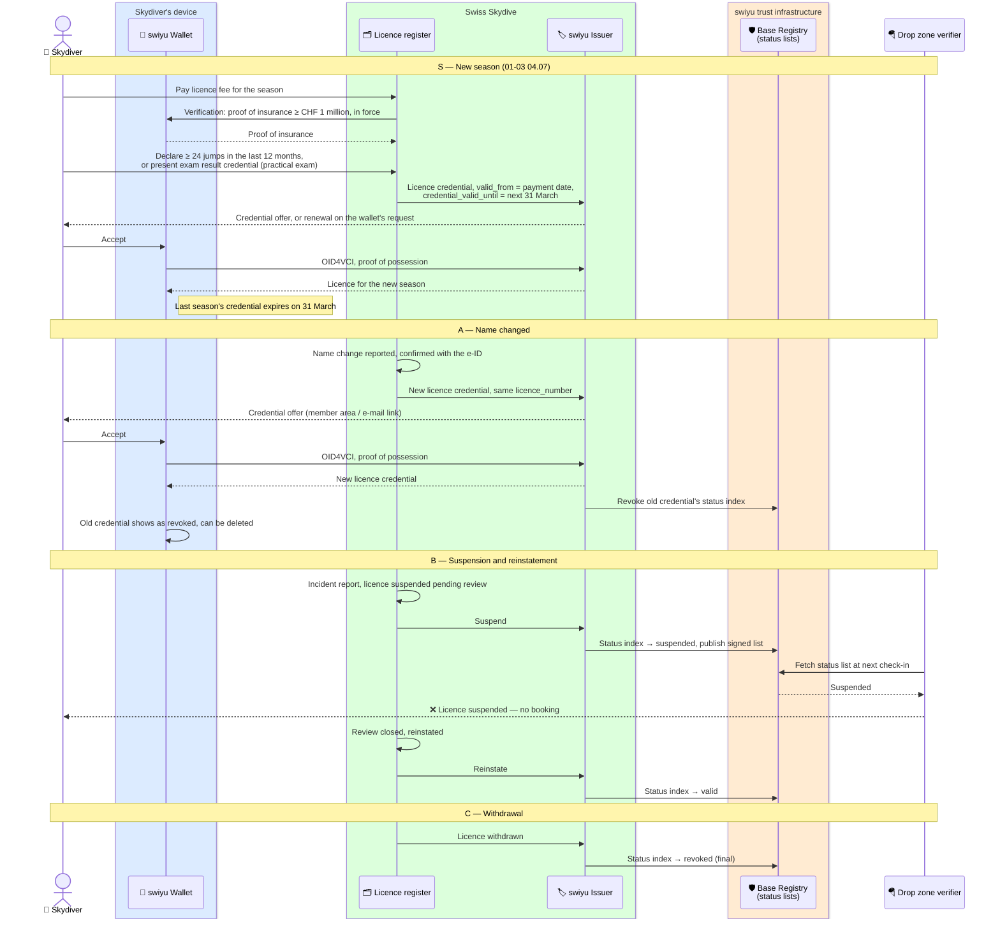

# Licence lifecycle

What happens to the licence credential after it is issued: it is renewed for
the next season, an endorsement is added,
a name changes, the licence is suspended after an incident or withdrawn.

Status: **draft**.

An SD-JWT VC cannot be edited. Every change is therefore one of two moves:

| Change | Move |
| --- | --- |
| New season: conditions of 01-03 04.07 met | New credential valid until the next 31 March, or wallet-initiated renewal. The old one expires by itself on 31 March, no revocation needed |
| New season: too few jumps | No renewal until the practical exam is repeated (01-03 04.08) |
| Name changed, endorsement added | Issue a new credential and revoke the old one, or let the wallet renew it |
| Suspension after an incident, pending review | Set the old credential's status to *suspended*; clear it if the review ends well |
| Licence withdrawn | Set the status to *revoked* |
| Member asks for the credential to be removed, device lost | Revoke; re-issue to the new wallet on request |

The licence register at Swiss Skydive stays the source of truth. The status
list is how its decisions reach every verifier without the verifier ever
calling Swiss Skydive, and without Swiss Skydive learning who checked.

## Knock-on effects on the other credentials

- **Proof of insurance** carries the `licence_number`, not a copy of the
  licence status. A drop zone that checks both sees a suspended licence and
  stops there. Whether the insurer also cancels the policy is its own rule.
- **Reserve repack** is about a rig and is not affected by the owner's licence.
  If the *rigger's* rigger licence is withdrawn, Swiss Skydive stops accepting new
  repacks from them. Existing repack credentials stay valid unless a repack is
  found faulty, in which case they are revoked individually.
- A new licence credential after a **name change** keeps the licence number,
  so the proof of insurance still matches.

## Renewal rules

Directive 01-03 (04.06–04.08) sets them:

- The licence runs from issue to **31 March** of the following year.
- To renew it, on the day of renewal the skydiver must have made **at least
  24 jumps in the past 12 months**, or passed the practical exam in the past
  12 months; must **pay the licence fee**; and must hold **third-party
  liability insurance of at least CHF 1 million** (VLK art. 13).
- Without the jumps, the skydiver reports to the jump director and repeats
  the practical exam. The examiner confirms the result in the logbook —
  "exam failed, licence not valid" or "exam passed, licence validated" — and
  fills in the exam protocol 02-09.

### The 24 jumps: a matter of governance, not of credentials

The jump count stays the **skydiver's declaration** at renewal. It is not
checked against a digital logbook, and no credential carries it:

- The logbook is paper, kept by the skydiver, with entries confirmed by the
  people 01-03 01.05 lists. There is no register of jumps to check against,
  and building one would put every jump of every member into a central
  system for the sake of one threshold a year.
- Directive 01-03 already places the responsibility on the skydiver: without
  the jumps they must **report of their own accord** to the jump director
  and repeat the practical exam (04.08).
- What keeps the declaration honest is governance: the logbook can be asked
  for at any drop zone, at an exam or after an incident, and a false
  declaration is grounds for withdrawal (04.04).

So the renewal flow records the declaration with the date and the
declarant, and the credential says only that the licence is valid. The
alternative path — the practical exam of 04.08 — produces an exam result
credential (see [licence issuance](./licence-issuance.md#the-exam-result-credential))
and is verifiable.

## What swiyu does with each state

Checked against the swiyu issuer and wallet code (see
[implementing on swiyu](./swiyu-implementation.md#status)):

- **Suspended** exists: a status list with `bits: 2`, set and cleared through
  the issuer's management API. The wallet shows the credential as suspended
  **but still presents it**. Every verifier must therefore reject
  `suspended` itself; the drop zone flow does.
- **Revoked** is final, and the wallet will no longer present the credential.
- **Renewal**: the issuer can offer wallet-initiated renewal through a
  renewal endpoint. Whether a renewal may carry changed claims, such as a new
  name, needs confirming; until then a change is revoke-and-reissue.

## Assumptions

- Swiss Skydive decides about suspension and withdrawal under its own rules.
  The flow shows how the decision propagates, not how it is taken.
