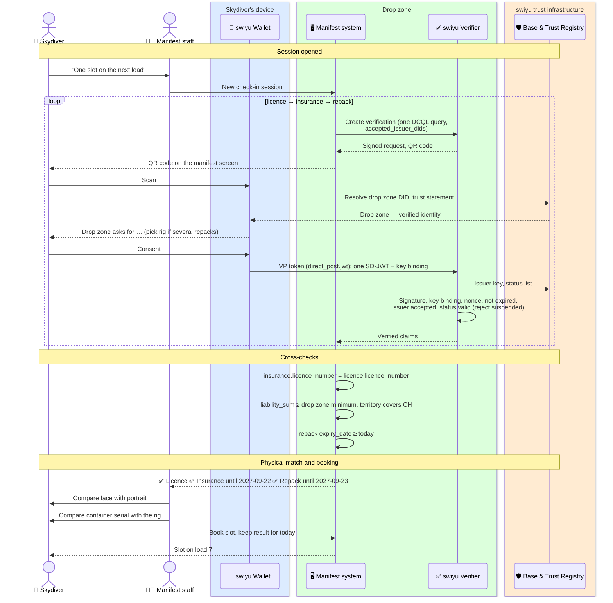

# Manifest check-in

Before booking a jump, the skydiver presents the three things manifest checks
today on paper — licence, insurance and reserve repack card — as three
credentials in one manifest session. The drop zone checks all three without
calling Swiss Skydive or the insurer, and cross-checks that they belong
together. A tandem master additionally presents the tandem master credential.

Status: **draft**.

**Requires** `qualification-credential-held`, `insurance-cover-held`, `equipment-inspection-current` · **Establishes** `access-granted`

| Credential | Issued in | Issuer | Replaces today |
| --- | --- | --- | --- |
| Skydiving licence | [Licence issuance](./licence-issuance.md) | Swiss Skydive | Licence card / member-portal entry |
| Proof of insurance | [Skydiving insurance](../insurance/README.md) | Swiss Skydive or an accepted insurer | Insurance certificate |
| Reserve repack | [Reserve repack](./reserve-repack.md) | Swiss Skydive, rigger named | Looking at the data card in the rig |
| Tandem master (tandem loads) | [Tandem master](./tandem-master.md) | Swiss Skydive | Rating card, manufacturer card |

Manifest also looks at the logbook for currency. That stays with the
logbook: a jump count that changes with every jump is not a credential.

## Three requests, one session

swiyu cannot answer several credentials in one request today: the verifier
rejects `credential_sets`, and the wallet submits one credential per request
(see [implementing on swiyu](./swiyu-implementation.md#verification)). The
manifest system therefore opens one session and runs three single-credential
DCQL requests in a row. The first one, for the licence, looks like this:

```json
{
  "credentials": [
    {
      "id": "licence",
      "format": "dc+sd-jwt",
      "meta": { "vct_values": ["https://swissskydive.org/vc/skydiving-licence/v1"] },
      "require_cryptographic_holder_binding": true,
      "claims": [
        { "path": ["licence_number"] },
        { "path": ["family_name"] },
        { "path": ["given_name"] },
        { "path": ["portrait"] }
      ]
    }
  ]
}
```

The insurance request asks for `licence_number`, `cover`, `liability_sum`,
`territory`; the repack request for `container_serial` and `expiry_date`.
Nothing else is asked for. Date of birth, policy number and the other serials
stay in the wallet.

When swiyu supports `credential_sets`, the three queries go into one request
and the three scans become one. No credential has to change for that.

## Flow



## Tandem loads

A tandem master presents the same three credentials, with two differences,
and a fourth credential:

| Check | Solo | Tandem |
| --- | --- | --- |
| Licence | ✅ | ✅ |
| Insurance | Third-party liability | Cover that includes carrying passengers; drop zone minimum for commercial tandem |
| Repack | The jumper's rig | The **tandem rig** on the load, often owned by the drop zone. Its repack must be signed by a rigger whose level covers tandem |
| Tandem master | — | Credential current (`expiry_date` not passed), not suspended, and a manufacturer rating in `system_ratings` that matches the tandem system on the load |

Manufacturer currency (for example, a number of tandem jumps within 90 or 365
days) is in the tandem master's logbook and the drop zone's own manifest
records, not in the credential. The drop zone checks it as it does today.

A tandem master may jump ten times a day. The drop zone keeps the verified
result for the day and does not ask again before every load.

## Where trust is decided

| Decision | Made by | On the basis of |
| --- | --- | --- |
| The licence is genuine and in force | Drop zone | Swiss Skydive's DID, status list |
| The cover is genuine, in force and belongs to this licence | Drop zone | Insurer's DID, status list, `exp`, matching `licence_number` |
| The reserve was repacked within 12 months by a rigger allowed to | Drop zone | Swiss Skydive's DID, `expiry_date`; the rigger's level was checked when the repack was issued |
| The tandem master may fly this tandem system | Drop zone | Tandem master credential, `system_ratings` |
| The person is the holder | Manifest staff | Portrait; the key binding shows the wallet is the one the licence was issued to |
| The rig on the back is the one repacked | Manifest staff | `container_serial` against the rig |
| Currency, weather, wing loading, load capacity | Drop zone | Its own rules and records |

## Assumptions

- **The paper stays for now.** The reserve data card belongs to the rig and
  the law may require the insurance certificate to be carried on the jump.
  The credentials let manifest check without the paper; whether they may
  replace it is for Swiss Skydive and FOCA to decide.
- **Foreign drop zones** need a verifier that trusts Swiss Skydive's DID, or
  they fall back to paper.
