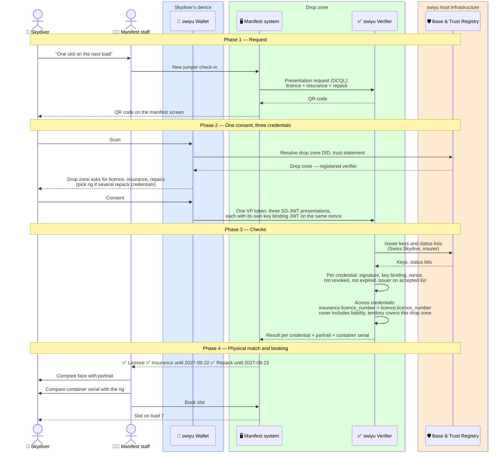

# Manifest check-in

Before booking a jump, the skydiver presents three credentials in one step:
the licence, the proof of insurance and the reserve repack. The drop zone
checks all three offline from Swiss Skydive and the insurer, and cross-checks
that they belong together.

Status: **draft**.

**Requires** `qualification-credential-held`, `insurance-cover-held`, `equipment-inspection-current` · **Establishes** `access-granted`

| Credential | Issued in | Issuer |
| --- | --- | --- |
| Skydiving licence | [Licence issuance](./licence-issuance.md) | Swiss Skydive |
| Proof of insurance | [Skydiving insurance](../insurance/README.md) | Insurer, or Swiss Skydive for a group policy |
| Reserve repack | [Reserve repack](./reserve-repack.md) | Swiss Skydive, rigger named |

## One request for three credentials

OID4VP lets a verifier ask for several credentials in one request. With DCQL
the drop zone lists three credential queries and one credential set that
requires all of them, so the wallet shows a single consent screen and returns
one VP token:

```json
{
  "credentials": [
    { "id": "licence",   "format": "vc+sd-jwt",
      "meta": { "vct_values": ["https://swissskydive.org/vc/skydiving-licence/v1"] },
      "claims": [ { "path": ["licence_number"] }, { "path": ["family_name"] },
                  { "path": ["given_name"] },     { "path": ["portrait"] } ] },
    { "id": "insurance", "format": "vc+sd-jwt",
      "meta": { "vct_values": ["https://example-insurer.ch/vc/sport-cover/v1"] },
      "claims": [ { "path": ["licence_number"] }, { "path": ["cover"] },
                  { "path": ["territory"] } ] },
    { "id": "repack",    "format": "vc+sd-jwt",
      "meta": { "vct_values": ["https://swissskydive.org/vc/reserve-repack/v1"] },
      "claims": [ { "path": ["container_serial"] }, { "path": ["packing_date"] } ] }
  ],
  "credential_sets": [ { "options": [ ["licence", "insurance", "repack"] ] } ]
}
```

Nothing else is asked for. Date of birth, ratings, policy number and serials
other than the container's stay in the wallet.

## Flow



## Where trust is decided

| Decision | Made by | On the basis of |
| --- | --- | --- |
| The licence is genuine and in force | Drop zone | Swiss Skydive's DID and status list |
| The cover is genuine, in force and belongs to this licence | Drop zone | Insurer's DID, status list, `exp`, matching `licence_number` |
| The reserve was repacked by a rated rigger within a year | Drop zone | Swiss Skydive's DID, `exp`; the rigger's rating was checked at issuance |
| The person is the licence holder | Manifest staff | Portrait; key binding shows the wallet is the one the licence was issued to |
| The rig on the jumper's back is the one repacked | Manifest staff | `container_serial` against the rig |
| Currency, weather, wing loading, load capacity | Drop zone | Its own rules, outside the credentials |

## Assumptions

- **Multi-credential requests.** DCQL supports them. Whether a given wallet
  version, the swiyu wallet included, already answers a request for three
  credentials in one consent needs checking. Until then the drop zone can send
  three requests in a row, which works the same and costs two extra scans.
- **Returning jumpers.** A drop zone may store the result and ask only for the
  repack again on later days, as long as insurance `exp` and licence status
  are rechecked. How long a stored result is good for is its own rule.
- **Foreign drop zones** need a verifier that trusts the swiyu Trust Registry,
  or they fall back to the card. This is where the credential saves the most
  and where it is least likely to work first.
