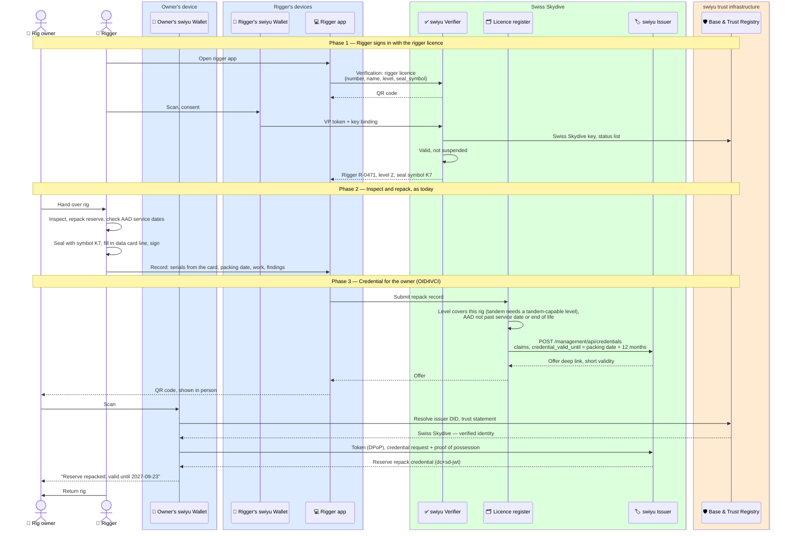

# Reserve repack

A rigger inspects and repacks the reserve parachute of a rig and has a repack
credential issued into the owner's swiyu wallet. It is valid for **12 months**
from the packing date. At manifest it lets the drop zone check the repack
without anyone opening the container to read the data card.

Status: **draft**.

**Requires** `qualification-credential-held` (the rigger licence, see [specialist qualifications](./specialist-qualifications.md)) · **Establishes** `equipment-inspection-current`

## Today: the data card in the rig

Every rig carries a reserve packing data card in a pocket of the container.
It is the permanent record of the rig and follows it through changes of
owner. The layout follows the Parachute Industry Association's standard for
packing data records; a Swiss card was not available to check.

| Section | Fields |
| --- | --- |
| Harness / container | Manufacturer, model, serial number, date of manufacture |
| Reserve canopy | Manufacturer, model, size, serial number, date of manufacture |
| AAD | Manufacturer, model, serial number, date of manufacture; service dates in the notes |
| Each repack line | Date, place, work done (inspect and repack, repair, alteration) and defects found, rigger name, rigger number, signature, **seal symbol** |

The seal on the reserve closing loop carries the rigger's personal seal
symbol, and the same symbol goes on the card line. An intact seal with that
symbol on the card is how anyone can see that nobody has opened the reserve
since. The rigger also keeps their own log of the work, separate from the card.

## What changes and what does not

| | Paper data card | Repack credential |
| --- | --- | --- |
| Lives | In the rig | In the owner's wallet |
| History | All repacks since manufacture | The current repack; older ones have expired |
| Read by | Whoever opens the pocket | A verifier, with the owner's consent |
| Protection against forgery | Signature and seal symbol | Swiss Skydive's signature, rigger named |
| Rig sold | Card goes with the rig | Credential stays with the seller; see below |

**The card stays.** The credential is issued alongside the card line, not
instead of it. The card is the rig's record; the credential is the owner's
proof towards a drop zone. Dropping the card is a decision for the rules,
not for this flow.

## Who signs the credential

The rigger does, in substance; Swiss Skydive does, technically. swiyu issuers
are single-tenant ([implementing on swiyu](./swiyu-implementation.md#issuance)),
and a drop zone should have to trust one DID for repacks, not one per rigger.
So the rigger signs in to a **rigger app** with their own rigger licence, the
licence register checks that the rigger's level covers this rig, and Swiss
Skydive's issuer signs a credential that names the rigger.

| | Swiss Skydive signs, rigger named (this flow) | Each rigger signs |
| --- | --- | --- |
| Issuer DIDs a drop zone trusts | One | One per rigger |
| Rigger licence withdrawn | Swiss Skydive refuses their next repack at once | Every drop zone must learn it |
| Level check (e.g. tandem rigs) | At issuance, by the licence register | By every verifier |
| swiyu today | Works: one issuer, management API | Every rigger would run an issuer and onboard a DID |

## Flow

The offer is shown to the owner in person with a short validity (a few
minutes). swiyu offers have no transaction code today, so whoever scans the
QR code first gets the credential; showing it only to the owner is the
protection.

## The repack credential

Every claim selectively disclosable. Dates are ISO dates.

| Claim | Example | From the data card |
| --- | --- | --- |
| `vct` | `https://swissskydive.org/vc/reserve-repack/v1` | — (placeholder URL) |
| `container_manufacturer`, `container_model`, `container_serial`, `container_dom` | `UPT`, `Vector 3`, `V3-24-01873`, `2024-03` | Harness / container |
| `reserve_manufacturer`, `reserve_model`, `reserve_size`, `reserve_serial`, `reserve_dom` | `PD`, `Reserve`, `160`, `R-55621`, `2024-01` | Reserve canopy |
| `aad_manufacturer`, `aad_model`, `aad_serial`, `aad_dom` | `Airtec`, `CYPRES 2`, `C2-99812`, `2023-11` | AAD |
| `aad_next_service`, `aad_end_of_life` | `2028-11`, `2039-05` | AAD notes. Depends on model: CYPRES 2 built from 2017 has optional service at 5 and 10 years and a 15.5-year life; Vigil has a 20-year life |
| `work` | `inspect-and-repack` | Repack line |
| `packing_date`, `packing_place` | `2026-09-23`, `Beromünster` | Repack line |
| `rigger_name`, `rigger_licence_number`, `rigger_level` | `Max Beispiel`, `R-0471`, `rigger-2` | Repack line |
| `seal_symbol` | `K7` | Repack line; matches the seal on the rig |
| `findings` | `none` | Repack line |
| `expiry_date` | `2027-09-23` | — packing date + 12 months; the wallet shows "Expired" after it |
| `exp` (protected) | `2027-09-23` | — set via `credential_valid_until`; after it the wallet will not present the credential |
| `status`, `cnf` (protected) | | Status list; bound to the owner's wallet |

`expiry_date` and `exp` fall on the same day. `expiry_date` gives the wallet
something to show; `exp` makes an overdue reserve impossible to present.
Twelve months is the interval this flow is specified for. The issuer should
take it from configuration rather than a constant, so a rig under a foreign
country's shorter interval (6 months in the UK, 180 days in the US) can get
its own.

The AAD is on the credential because manifest looks for it today, and because
an AAD past its service date or end of life makes the repack pointless. If
AAD services turn out to be done by other people at other times, the AAD
becomes its own credential.

## Edge cases

- **Rig sold.** The card goes with the rig; the credential does not. On the
  seller's request Swiss Skydive revokes it, and the buyer either has the
  reserve repacked or asks the rigger who packed it to issue the buyer a
  credential for the same repack, with the same `expiry_date`.
- **Several rigs.** One credential per rig. The wallet lets the jumper pick
  the rig at manifest; the drop zone matches `container_serial`.
- **Drop zone rigs.** Student and tandem rigs belong to the drop zone. Their
  repack credentials sit in the drop zone's own wallet or its records; the
  jumper does not present them.
- **Faulty repack found.** Swiss Skydive revokes the credential; the rig
  needs a new repack.
- **Seal broken.** Nothing digital knows. The reserve is repacked and a new
  credential issued; staff still look at the seal.

## Open questions

1. Rigger levels in Switzerland, and which of them covers tandem rigs.
2. Do Swiss drop zones accept a repack under a foreign rig's shorter interval,
   or always apply 12 months?
3. Is Swiss Skydive willing to sign on behalf of riggers it licenses but does
   not employ?
