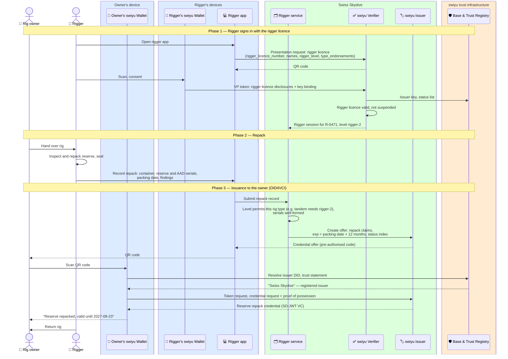

# Reserve repack

A rigger repacks the reserve parachute of a rig and issues a repack credential
into the owner's swiyu wallet. The credential is valid for one year from the
packing date. At the drop zone it replaces the data card sewn into the
container, which manifest staff cannot see without opening the rig.

Status: **draft**. See [open questions](#open-questions).

**Requires** `qualification-credential-held` (the rigger licence, see [specialist qualifications](./specialist-qualifications.md)) · **Establishes** `equipment-inspection-current`

## Who signs the credential

A repack credential is only worth checking if the verifier knows the signer was
a rigger. There are two ways to get there, and they differ in who has to be on
the swiyu Trust Registry.

| | A. Swiss Skydive signs, rigger named | B. Each rigger signs |
| --- | --- | --- |
| Issuer DID | Swiss Skydive's, the same as for the licence | One per rigger or rigging loft |
| Trust Registry entries | One | One per rigger |
| Verifier checks | One issuer it already trusts | Every rigger, plus whether their rigger licence and level are current |
| Rigger licence withdrawn | Swiss Skydive stops accepting repacks from that rigger at once | Every verifier must learn it |
| Rigger authenticates by | Presenting their rigger licence, whose level must permit the work | Their own issuer key |

**This flow uses A.** The rigger proves the qualification by presenting their
own rigger licence to a Swiss Skydive rigger service, which then signs the
repack credential and names the rigger in it. A drop zone that already trusts
the licence needs nothing new, and a withdrawn rigger licence takes effect at the next
repack rather than whenever each drop zone updates a list. Option B stays open
for riggers abroad, whose repacks a Swiss drop zone would otherwise have to
check against a paper data card.

## Flow

## The repack credential

| Claim | Example | Notes |
| --- | --- | --- |
| `vct` | `https://swissskydive.org/vc/reserve-repack/v1` | Placeholder URL |
| `container_serial` | `JV-24-01873` | Identifies the rig. The drop zone matches it against the rig on the jumper's back |
| `reserve_type`, `reserve_serial` | `PD Reserve 160`, `R-55621` | |
| `aad_type`, `aad_serial` | `Cypres 2`, `C2-99812` | Optional. AAD service dates could go here or in a separate credential |
| `packing_date` | `2026-09-23` | |
| `exp` | `2027-09-23` | Packing date plus 12 months. The drop zone rejects an expired credential without asking anyone |
| `rigger_name`, `rigger_licence_number`, `rigger_level` | `Max Beispiel`, `R-0471`, `rigger-2` | Who packed it; for incident follow-up |
| `status` | status list reference | For a repack found faulty, or a rig reported stolen |
| `cnf` | owner's wallet key | Bound to the owner, not to the rig |

**One year** is the validity asked for here. The interval a repack actually
has to be renewed in is set by the applicable rules, and the issuer should take
`exp` from them rather than from a constant, so a change in the rules does not
need a new credential type.

The credential describes a rig and is held by a person. Two consequences:

- **The rig changes hands.** The seller's credential is not transferred.
  Swiss Skydive revokes it on request and the buyer gets a fresh one, or the
  buyer gets the rig repacked. Which of the two is a question for the rules.
- **Several rigs.** A jumper with two rigs holds two repack credentials. At
  manifest the wallet offers the one whose `container_serial` the jumper picks.

## Open questions

1. Is Option A acceptable to Swiss Skydive, given that it then signs statements
   about work done by riggers it has licensed but does not employ?
2. Is the repack interval twelve months for all rigs at Swiss drop zones, or
   does it depend on the reserve or the country the rig is used in?
3. Should the AAD service be part of the repack credential or its own?
