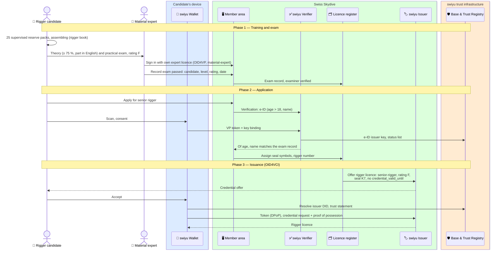
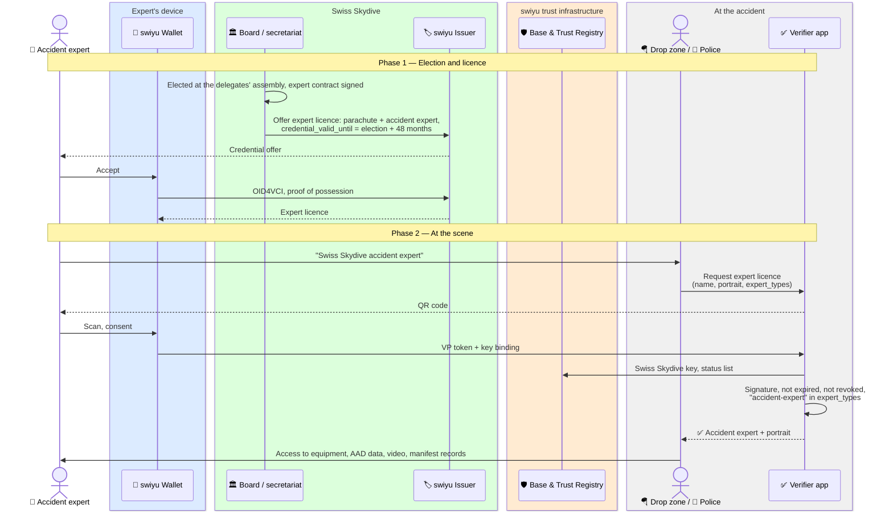

# Specialist qualifications: rigger licences and expert licences

Swiss Skydive issues two further kinds of licence, each as its own credential:

- a **rigger licence** — senior rigger or master rigger, with a rating for
  round canopies, ram-air canopies or both — which says what work on a
  parachute system the holder may do and certify (directive **01-09d**,
  valid from June 2025), and
- an **expert licence** — parachute expert, accident expert or material
  expert — held by the people the delegates' assembly elects to examine,
  inspect schools and investigate accidents (directive **01-10d**, valid from
  February 2025).

Status: **draft**. Part of the `skydiving-licence` family.

**Requires** `eid-held` · **Establishes** `qualification-credential-held`

## Why separate credentials, not entries on the skydiving licence

| | Entry inside the skydiving licence | Separate credential |
| --- | --- | --- |
| Different validity | The rigger licence is unlimited, the expert licence runs 48 months, the skydiving licence to 31 March — one `exp` cannot hold all three | Each carries its own |
| What a verifier sees | Must request the skydiving licence and look inside it | Requests exactly the licence it needs |
| Withdrawing one | Revoke and re-issue the skydiving licence | Revoke only that credential |

Every licence that lets its holder take responsibility for someone else's
safety is its own credential: rigger, expert and
[tandem](./tandem-pilot.md).

## Rigger licence (01-09d)

### The rules

| Topic | Rule | § |
| --- | --- | --- |
| Basis | Swiss Skydive has no airworthiness system of its own; everything rests on the manufacturers' instructions, the Poynter manual and the FAA *Parachute Rigger Handbook* | 01.01–02 |
| Senior rigger | Of age (> 18), proof of English. Rating **R** (round canopies), **F** (ram-air) or **R + F**. Training: 25 supervised reserve packs, assembling. Exam: theory (≥ 75 %, ≥ 20 % of questions in English) and practical | 02, 05.01, 06.01 |
| Master rigger | Senior rigger for ≥ 3 years with ≥ 100 reserve packs. Exam: theory and a professional repair of a main or reserve and of a harness/container | 03, 06.02 |
| Senior rigger may | Pack reserves; minor and major repairs on **main** canopies; **certify airworthiness** | 04.01 |
| Master rigger may | Everything a senior rigger may; minor and major repairs on main **and reserve** systems; carry out STCs | 04.02 |
| Who examines | The **material expert** (01-10d 01.01 c) | |
| Validity | **Unlimited.** The annual fee keeps the rigger on the bulletin list and in the **Swiss Skydive rigger directory** | 07.02 |
| Withdrawal | Swiss Skydive may refuse or withdraw a licence on well-founded doubts about mental or character fitness | 07.01.02 |
| Seal | Each rigger has symbols (numbers/letters) assigned by Swiss Skydive, pressed with a seal press or an alternative SSD seal | 01.04 d, 01.06 |
| Rigger book | All rigger work recorded completely and chronologically, kept for ≥ 5 years | 01.07 |
| Foreign riggers | Senior with < 100 packs in 5 years: Swiss exam. Senior with more, and master: introduced by a Swiss master rigger, confirmed in the rigger book; Swiss Skydive then issues the licence | 08 |

### The credential

| Claim | Example | From the rules |
| --- | --- | --- |
| `vct` | `https://swissskydive.org/vc/rigger-licence/v1` | — (placeholder URL) |
| `rigger_licence_number` | `R-0471` | The rigger's ID number, which goes on every packing card (01.06 g) |
| `rigger_level` | `senior-rigger` or `master-rigger` | 02, 03 |
| `rigger_rating` | `["R", "F"]` | Round, ram-air, or both (02.02) |
| `seal_symbol` | `K7` | Symbols assigned by Swiss Skydive (01.06) |
| `family_name`, `given_name` | | |
| `issue_date` | `2025-06-14` | |
| `listed_until` | `2027-03-31` | Optional: annual fee paid, listed in the rigger directory (07.02). Not a validity limit |
| `status`, `cnf` (protected) | | 2-bit list: suspension and withdrawal |

No `exp`: the licence is unlimited. The directory listing is the only thing
that lapses, and it lapses without affecting the licence.

## Expert licence (01-10d)

### The rules

| Topic | Rule | § |
| --- | --- | --- |
| Kinds | **Parachute expert**; **accident expert** (always also a parachute expert, not the other way round); **material expert** | 01.00 |
| All experts | Report irregularities by function holders; may examine in every area in which they hold a licence | 01.01 |
| Parachute expert | School inspections and investigations, admission and instructor exams, writes the directives | 01.01 a |
| Accident expert | Investigates parachute accidents for Swiss Skydive as expert witness; writes reports for Swiss Skydive and outside bodies; advises police and investigating authorities on securing evidence | 01.01 b |
| Material expert | Supports the other experts; examines riggers and packers; writes directive 01-09 | 01.01 c |
| Nomination | Parachute and accident expert: valid licence, ≥ 5 years active instructor, valid AFF or tandem rating, no withdrawal or written reprimand in 10 years. Material expert: master rigger (or foreign equivalent) for ≥ 5 years, same record | 02.01 |
| Election | Proposals by 30 November; interview with the board; secret ballot at the delegates' assembly | 02.02 |
| Validity | **48 months** from election and expert contract; then renewed by **12 months** at a time on proof of expert activity in the past calendar year | 03.01–02 |

### The credential

| Claim | Example | From the rules |
| --- | --- | --- |
| `vct` | `https://swissskydive.org/vc/expert-licence/v1` | — (placeholder URL) |
| `expert_types` | `["parachute-expert", "accident-expert"]` | 01.00; an accident expert always also carries `parachute-expert` |
| `licence_number` | `1234` | The expert's skydiving licence |
| `family_name`, `given_name`, `portrait` | | Portrait (`data:image/jpeg;base64,…`), because the licence is shown in person at an accident |
| `elected_on` | `2026-04-25` | Delegates' assembly |
| `valid_from`, `expiry_date` | `2026-04-25`, `2030-04-24` | 48 months, then 12 months per renewal |
| `exp` (protected) | `2030-04-24` | Set via `credential_valid_until` |
| `status`, `cnf` (protected) | | 1-bit list: withdrawal |

## Flow A — Rigger licence

For master rigger the flow is the same, with the senior rigger licence
presented in phase 2 and the 3 years and 100 packs checked from it and from the
rigger book.

## Flow B — Accident expert at an accident

The licence answers "is this person Swiss Skydive's accident expert". What
they may see and secure is governed by the police and, for accidents
involving the aircraft, the Swiss Transportation Safety Investigation Board
(STSB / SUST); the expert's role there is to advise (01-10d 01.01 b).

## Open questions

1. Should the rigger directory listing (annual fee) be visible to a verifier,
   or stay in Swiss Skydive's register?
2. Where do *Fallschirmwart* and *Fallschirmpacker*, which the material expert
   examines (01-10d 01.01 c), fit relative to senior and master rigger?
3. A police officer is unlikely to have a verifier app today. The check at
   the scene needs a verifier on the drop zone's side.
