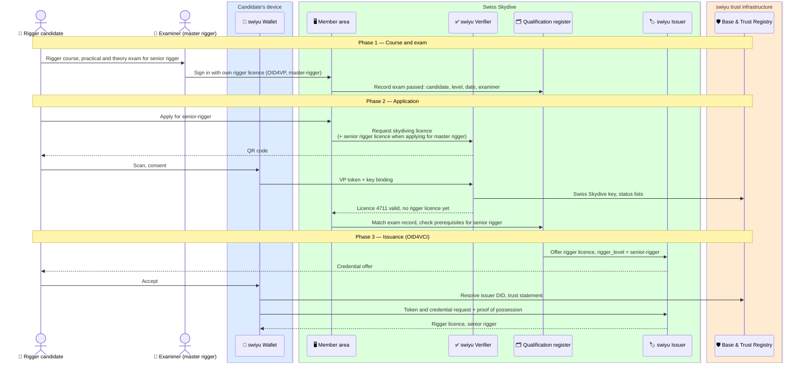
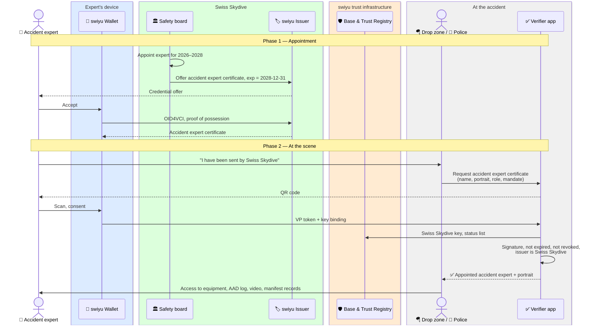

# Specialist qualifications: rigger licences and accident experts

Swiss Skydive issues two kinds of qualification beyond the skydiving licence,
each as its own credential:

- a **rigger licence**, in levels, which says what work on a rig the holder may
  do and sign for, and
- an **accident expert certificate**, which says the holder is appointed to
  investigate skydiving accidents and incidents for Swiss Skydive.

Status: **draft**. The two rigger levels and the "expert" function are named
in the Swiss Skydive directives listed by its Safety Management System:
**01-09d Master- und Senior Rigger** and **01-10d Experten**. The directives
themselves could not be read; what each level permits is taken by analogy
from the FAA senior and master rigger certificates until they are.

Part of the `skydiving-licence` family. The rigger licence builds on the skydiving licence; the accident expert certificate does not have to.

**Requires** `eid-held` · **Establishes** `qualification-credential-held`

## Why separate credentials, not ratings on the licence

| | Rating inside the licence | Separate credential |
| --- | --- | --- |
| Level raised | Re-issue the licence | Re-issue only the rigger licence |
| Accident expert appointed for a term | Licence needs an `exp` it does not otherwise have | The certificate carries its own `exp` |
| What a verifier sees | Must request the licence and look inside it | Requests exactly the qualification it needs |
| Withdrawing one qualification | Revoke and re-issue the whole licence | Revoke only that credential; the licence is untouched |

Every qualification that lets the holder take responsibility for someone
else's safety gets its own credential: rigger, accident expert and
[tandem master](./tandem-master.md). Swiss Skydive treats these as functions
with their own rules and annual validation, which is the same line.

## Rigger licence

### Levels

| `rigger_level` | Directive | May do (by analogy with FAA 14 CFR 65.125, to confirm against 01-09d) |
| --- | --- | --- |
| `senior-rigger` | 01-09d | Inspect, pack and maintain; minor repairs. Signs reserve repacks |
| `master-rigger` | 01-09d | As senior rigger, plus major repairs and alterations; trains and examines riggers |

The claim carries the level; what a level permits is published by Swiss
Skydive and applied by the rigger service at the time of signing (see
[reserve repack](./reserve-repack.md)). That keeps the credential stable when
the rules move.

| Claim | Example | Notes |
| --- | --- | --- |
| `vct` | `https://swissskydive.org/vc/rigger-licence/v1` | Placeholder URL |
| `rigger_licence_number` | `R-0471` | |
| `rigger_level` | `senior-rigger` | |
| `type_endorsements` | `["tandem-vector", "tandem-sigma"]` | Optional. Rig types the rigger is signed off on, where the rules need it |
| `seal_symbol` | `K7` | The rigger's personal seal symbol, pressed into the seal and written on the data card. Carried into every repack credential |
| `licence_number` | `4711` | Links to the skydiving licence |
| `family_name`, `given_name`, `birth_date` | | From the skydiving licence |
| `issue_date` | `2026-09-23` | |
| `exp` | — | Only if rigger licences expire or need periodic proof of activity |
| `status`, `cnf` | | Suspension and withdrawal; holder binding |

### Accident expert certificate

| Claim | Example | Notes |
| --- | --- | --- |
| `vct` | `https://swissskydive.org/vc/accident-expert/v1` | Placeholder URL |
| `expert_id` | `UE-012` | |
| `role` | `accident-expert` | |
| `mandate` | `Swiss Skydive accident and incident investigation` | What the appointment covers |
| `family_name`, `given_name`, `portrait` | | Portrait (`data:image/jpeg;base64,…`), because the certificate is shown in person at an accident site |
| `valid_from`, `exp` | `2026-01-01`, `2028-12-31` | Assumption: appointments run for a term |
| `status`, `cnf` | | Revoked when the appointment ends early |

## Flow A — Issuing or raising a rigger licence

The examiner's own rigger licence is what makes the exam record trustworthy:
only a master rigger may record a rigger exam. The same pattern — a qualification
credential that lets its holder sign for others — is what the reserve repack
flow uses.

## Flow B — Appointing an accident expert and showing the certificate at an accident

At the scene the drop zone or the police decide on access. The certificate
answers only "is this person appointed by Swiss Skydive"; what they may see
and take is governed by Swiss Skydive's rules and, where the Swiss
Transportation Safety Investigation Board (STSB / SUST) or the police
investigate, by theirs.

## Assumptions and open questions

1. **Levels.** Senior and master rigger are Swiss Skydive's levels (01-09d).
   What each permits, which covers tandem rigs, and whether type endorsements
   are needed must be read from 01-09d.
2. **"Experten" (01-10d)** may cover more than accident experts, for example
   examiners. The accident expert certificate here is one function of that
   directive, not necessarily all of it.
3. **Expiry.** Does a rigger licence lapse without activity? Is an accident
   expert appointed for a term?
4. **Verifier at the scene.** A police officer is unlikely to have a verifier
   app today. Until then the certificate is shown on the wallet screen, which
   is no better than a card; the verifiable check needs a verifier on the
   drop zone's side.
5. **Flow B mixes two kinds of work** — certifying the expert and granting
   access at the scene. If accident investigation grows further flows, the
   scene check becomes its own family.
