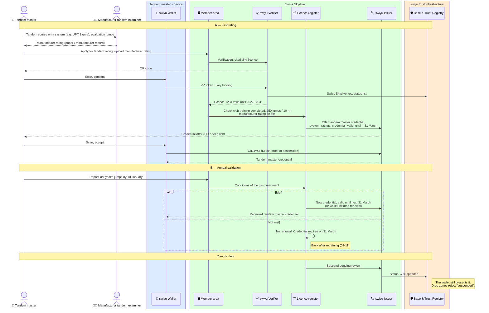

# Tandem master

Swiss Skydive issues the tandem master qualification as its own credential,
renews it every year on the tandem master's activity report, and records in
it the manufacturer ratings the tandem master holds. The drop zone checks it
before a tandem load ([manifest check-in](./manifest-check-in.md#tandem-loads)).

Status: **draft**. Part of the `skydiving-licence` family.

**Requires** `eid-held` and the skydiving licence · **Establishes** `qualification-credential-held`

## Today

What public sources say. Swiss Skydive's Safety Management System lists two
tandem directives, **01-05d Tandem** (the tandem master) and **01-11d
Tandembetrieb** (running a tandem operation). Neither could be read from here;
the gaps are listed at the end.

| Topic | Today | Source |
| --- | --- | --- |
| Entry to training | 750 jumps and 10 hours of freefall, plus further criteria in the tandem guidelines. Training takes place within the club | Swiss Skydive, *Ausbildungskonzept* (00-08d) |
| Two ratings | A Swiss Skydive rating **and** a manufacturer rating for each tandem system (e.g. UPT Sigma, Strong), given by that manufacturer's tandem examiner | Swiss Skydive; UPT and Strong instructor pages |
| Annual validation | Instructors and tandem masters are reviewed and validated every year. Rated members report their jumps of the past year in the member portal by 10 January | Swiss Skydive FAQ |
| Validity pattern | Swiss Skydive instructor ratings are valid until 31 March of the following year and renewed automatically when the conditions of the past year are met; lapsed for one to three years means retraining (02-11) | Swiss Skydive, 01-06 (PAC); assumed to apply to tandem as well |
| Manufacturer currency | UPT: 25 tandem jumps in 365 days, 3 in 90 days, recurrent training after 180 days without a tandem. Strong: 90-day, 6-month and 12-month tiers | UPT Sigma manual, Strong currency page |
| Medical | Manufacturers ask for an aviation medical (FAA class 3 or foreign equivalent). The Swiss requirement was not found | UPT |

## The tandem master credential

Separate from the skydiving licence because it expires every year, has its
own conditions and is checked only on tandem loads.

| Claim | Example | Notes |
| --- | --- | --- |
| `vct` | `https://swissskydive.org/vc/tandem-master/v1` | Placeholder URL |
| `licence_number` | `1234` | Links to the skydiving licence |
| `family_name`, `given_name`, `portrait` | | From the licence; portrait as `data:image/jpeg;base64,…` |
| `system_ratings` | `[{"system": "UPT Sigma", "rated_on": "2024-05-10"}, {"system": "Strong Dual Hawk", "rated_on": "2025-06-02"}]` | Manufacturer ratings Swiss Skydive has on file. Each element disclosable, so the drop zone sees only the system it uses |
| `commercial` | `true` | Assumption: whether the holder may take paying passengers, if Swiss Skydive distinguishes |
| `valid_from` | `2026-04-01` | |
| `expiry_date` | `2027-03-31` | 31 March of the following year |
| `exp` (protected) | `2027-03-31` | Set via `credential_valid_until`; a lapsed tandem master cannot present it |
| `status`, `cnf` (protected) | | 2-bit list: suspension after an incident |

Deliberately not in the credential:

- **Manufacturer currency** (tandem jumps in the last 90 and 365 days). It
  changes with every jump and lives in the logbook and the drop zone's
  manifest records.
- **Medical details.** If a medical is required, Swiss Skydive checks it
  before issuing or renewing and the credential simply is not renewed without
  one. At most a `medical_valid_until` date, never a diagnosis or class.

The manufacturers are not on the swiyu Trust Registry, so the drop zone
cannot verify a manufacturer rating from the manufacturer. `system_ratings`
is Swiss Skydive's statement that it has seen the rating. If manufacturers
issue verifiable ratings one day, `system_ratings` goes away.

## Flow

## The same pattern for other functions

Swiss Skydive rates other functions the same way — jumpmaster (Sprungleiter,
01-04), AFF/PAC instructor (01-06) — with annual validation and a 31 March
cycle. Each would be a credential of this shape with its own `vct`. They are
not drawn here because no drop zone flow needs them yet.

## Open questions for Swiss Skydive

1. The criteria in the tandem guidelines beyond 750 jumps and 10 hours:
   age, years in the sport, prior ratings.
2. Does the 31 March cycle of document 01-06 apply to tandem masters?
3. Minimum tandem jumps per year for renewal, and what a lapse means.
4. Is a medical required in Switzerland, which one and how often?
5. Is a distinction between commercial and non-commercial tandem needed?
6. Would Swiss Skydive rather hold the manufacturer ratings in its register,
   or ask manufacturers for verifiable ratings?
