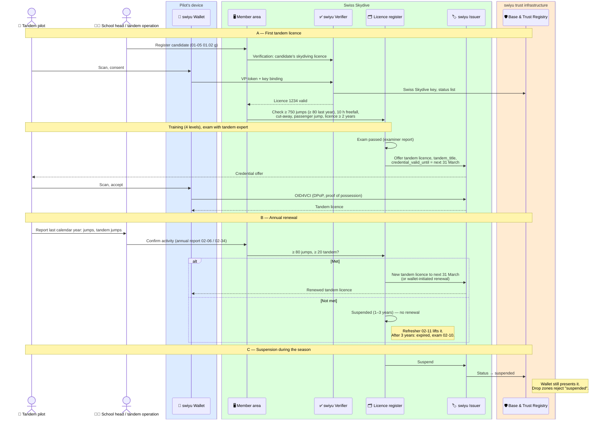

# Tandem pilot

Swiss Skydive issues the tandem licence as its own credential, renews it every
year on the pilot's reported activity, and suspends it when the activity is
missing. The drop zone checks it before a tandem load
([manifest check-in](./manifest-check-in.md#tandem-loads)).

Status: **draft**. Part of the `skydiving-licence` family.

**Requires** `eid-held` and a Swiss Skydive licence · **Establishes** `qualification-credential-held`

## The rules: directive 01-05 *Tandem*

Read from 01-05f *Pilote Tandem* (valid from May 2024; the German version
prevails) and 01-11d *Tandembetrieb* (valid from March 2023).

| Topic | Rule | § |
| --- | --- | --- |
| Entry | ≥ 750 jumps, of which ≥ 80 in the past calendar year; ≥ 10 h cumulative freefall; ≥ 1 cut-away; ≥ 1 jump as tandem passenger; skydiving licence for ≥ 2 calendar years; a Swiss Skydive licence; registered through a Swiss Skydive school, which commits to the candidate's further training | 01-05 01.02 |
| Titles | **Tandem pilot** (skydiver with tandem licence), **tandem instructor** (instructor with tandem licence), **tandem expert** (expert with tandem licence) | 01-05 01.03 |
| Training | Course recognised by Swiss Skydive, or an experienced tandem instructor (≥ 2 years) in a Swiss Skydive school or tandem operation; four levels of training jumps | 01-05 02 |
| Exam | Coordinated by the Swiss Skydive secretariat; examiner is a tandem expert or a delegated experienced tandem instructor with a valid tandem instructor licence, not the candidate's only trainer. Test lesson, questions, packing, one jump with the examiner as passenger | 01-05 03 |
| Validity | From the date of issue to **31 March** of the following year | 01-05 05.01 |
| Renewal | Automatic for one year if the past calendar year shows **≥ 80 jumps, of which ≥ 20 tandem**, or a passed exam. The pilot reports the activity by the end of the year through the school or operation, whose head confirms it | 01-05 05.02, 01.04 |
| Missing activity | **1–3 years: suspended**, lifted by a refresher (document 02-11). **More than 3 years: expired**, new exam (02-10) | 01-05 05.03, 04 |
| Foreign tandem licence | Validated if the applicant meets the entry conditions, passed the Swiss law/directives/safety theory, has ≥ 2 years and ≥ 300 tandem jumps as pilot, and passes the exam. Validation also issues the Swiss Skydive licence | 01-05 05.05 |
| Where tandems happen | Only under a Swiss Skydive school or a Swiss Skydive **tandem operation** with an operating permit (form 02-33), flown by Swiss Skydive tandem pilots or by assistants with a foreign licence reported to Swiss Skydive (form 02-20) | 01-11 03.07 |
| Equipment | Tandem rigs must carry an AAD. Main open at ≥ 1,200 m above ground; emergency decision at 1,000 m | 01-00 01.10, 02, 03 |

The directive does not mention manufacturer ratings. The tandem system
manufacturers require their own rating per system (for example UPT Sigma,
Strong), so drop zones will still want to see it, but it is not a Swiss
Skydive condition.

## The tandem licence credential

| Claim | Example | From the rules |
| --- | --- | --- |
| `vct` | `https://swissskydive.org/vc/tandem-licence/v1` | — (placeholder URL) |
| `licence_number` | `1234` | Links to the skydiving licence |
| `family_name`, `given_name`, `portrait` | | From the licence; portrait as `data:image/jpeg;base64,…` |
| `tandem_title` | `tandem-pilot`, `tandem-instructor` or `tandem-expert` | 01-05 01.03 |
| `school_or_operation` | `Skydive Beispiel` | The school or tandem operation that registered the pilot and confirms the activity (01-05 01.02 g, 05.02) |
| `valid_from` | `2026-04-01` | 01-05 05.01 |
| `expiry_date` | `2027-03-31` | 01-05 05.01 |
| `exp` (protected) | `2027-03-31` | Set via `credential_valid_until` |
| `system_ratings` | `[{"system": "UPT Sigma", "rated_on": "2024-05-10"}]` | Optional. Manufacturer ratings, if Swiss Skydive chooses to record them; not a condition in 01-05 |
| `status`, `cnf` (protected) | | 2-bit list: see below |

### How the tandem states map to swiyu

| 01-05 state | Credential |
| --- | --- |
| Valid | Current season's credential, status *valid* |
| Renewed (activity confirmed) | New credential to the next 31 March, or wallet-initiated renewal |
| **Suspended** (1–3 years without the activity) | No renewal on 31 March; if suspended during a season, status *suspended*. The refresher (02-11) lifts it: status back to *valid*, or a new credential |
| **Expired** (> 3 years) | No credential. A passed exam (02-10) starts over |
| Withdrawn (01-05 05.04 via 01-03) | Status *revoked* |

swiyu's *suspended* status matches the directive's own word. The wallet
still presents a suspended credential, so the drop zone must reject it.

## Flow

## Related credentials this suggests

- **Tandem operation permit** (01-11, form 02-33). The operation, not a
  person, holds it; it is renewed tacitly on the annual report and can be
  suspended or withdrawn. A permit credential in the operation's own wallet
  would let a passenger or an airfield check that tandems there run under
  Swiss Skydive. It needs an organisational wallet, which swiyu does not
  have yet.
- **Foreign-licence assistants** (01-08, form 02-20) may fly tandems once
  reported. Their report could be a short-lived credential of the same shape.

## Open questions for Swiss Skydive

1. Should manufacturer ratings be recorded in the tandem licence at all?
2. Is the German 01-05d identical to the French version read here?
